# BioSymphony Ferm DoE

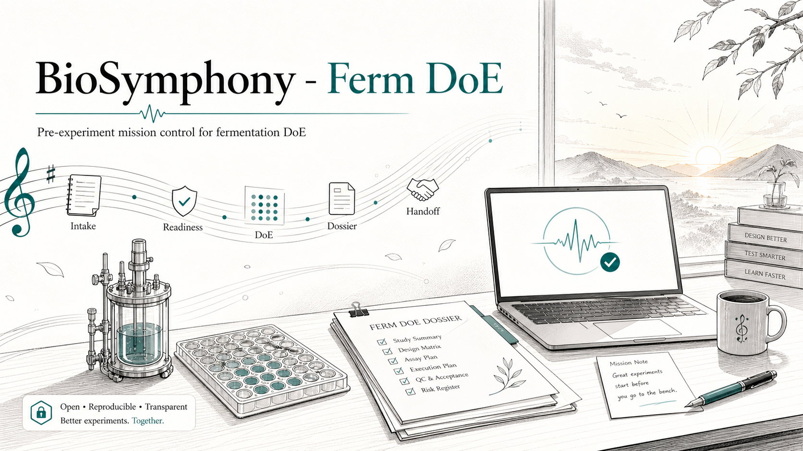

[](https://github.com/BioSymphony/ferm-doe/actions/workflows/ci.yml)
[](LICENSE)
[](https://www.python.org/downloads/)
[](#status)

**A multi-agent skill for constraint-aware experimental design in fermentation and biomanufacturing.**

Any coding agent harness can drive it: Symphony with Linear, Claude Code workers with Linear, Codex CLI, OpenAI Agents SDK, or a custom orchestrator. State lives in one file (`campaign_manifest.json`), so sessions pause, resume, fan work across parallel sub-agents, and hand off cleanly between agents and humans. The same commands run on a laptop, in CI, or behind an AWS Lambda or Modal endpoint, so the user picks local or cloud per task.

The loop is:

1. **Frame the design problem.** Turn a rough objective, responses, factors, scale context, constraints, and supporting references into a durable `campaign_manifest.json`.
2. **Generate useful designs.** Route to stdlib DoE, BoFire, ENTMOOT, OMLT, TabPFN, BoTorch, or reference-DOE utilities with explicit adapter status and claim labels.
3. **Close the loop.** Analyze the first-batch results, plan the follow-up batch, preserve negative-result memory, and produce a run packet plus `expected/AGENTS.md` handoff.
4. **Coordinate the work.** Run locally, hand to a repo-local coding agent, split into issue packs, mirror status into Linear, or expose selected checks through AWS Lambda or Modal.

Terminology note: the repo keeps internal identifiers such as `wave1`, `wave2`, `plan-wave2`, and `planned_wave2_design` because they are stable artifact and CLI contracts. They are checkpoint labels, not a predetermined experiment schedule. In public-facing copy, think "first batch," "follow-up batch," or "adaptive next step": results are QC-reviewed before the next action is chosen.

Key capabilities implemented in code:

- A curated 47-tool BO/DoE and sidecar registry (`docs/TOOL_REGISTRY.md`, `docs/tool-registry.json`) with documented tradeoffs and direct adapters for the load-bearing entries (BoFire, ENTMOOT v2, OMLT, TabPFN, BoTorch, pyDOE3, SALib, scipy, PubMed MCP).
- A public adaptive-backend surface (`docs/BIOMANUFACTURING_ADAPTIVE_BACKENDS.md`, `docs/adaptive-backend-evaluation.json`) that lets BoFire, BayBE, Ax/BoTorch, ENTMOOT, OMLT, and TabPFN compete behind the same design preflight checks.
- A cost-model honesty stack: simulator number, plus bulk-reagent number, plus fully-loaded shake-flask COGS, plus CMO benchmark, plus a stated range. Documented in `docs/COST_MODEL_REALISM_CHECK.md` with `templates/cost_stack.template.md`.
- Scale-bridge objects with explicit kLa, P/V, tip-speed, mixing-time, OUR, RQ, VVM, and geometric-similarity criteria.
- A durable campaign manifest that supports pause, resume, Linear-backed review, and handoff between agent sessions or between an agent and a human.

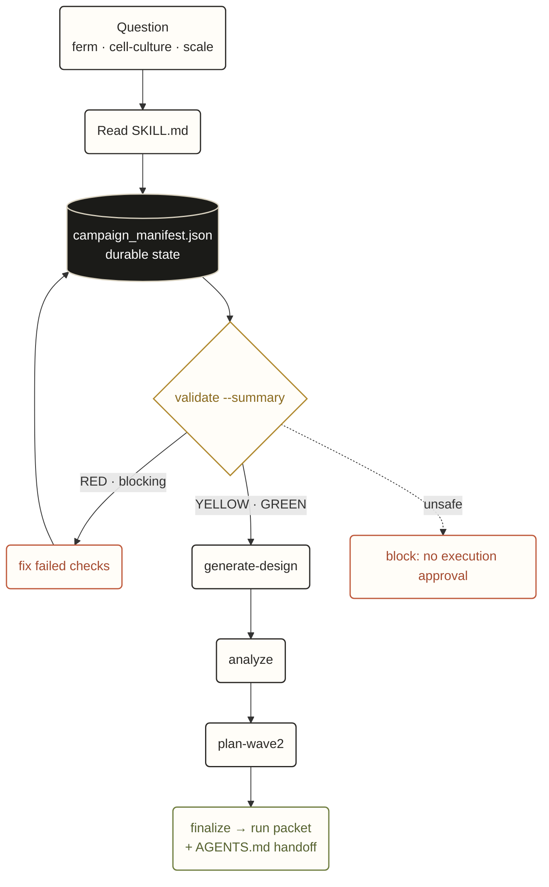

## Design maps

These diagrams summarize the main design surfaces: experiment inputs, scale-transfer criteria, and DoE family choice. See [`docs/VISUAL_OVERVIEW.md`](docs/VISUAL_OVERVIEW.md) for the short notes behind each diagram.

### Experiment design map

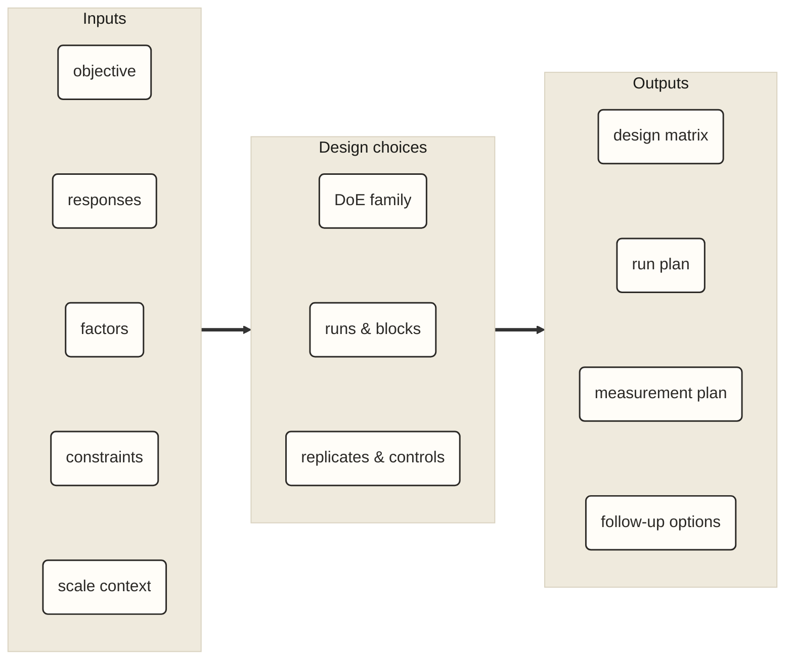

### Scale transfer criteria

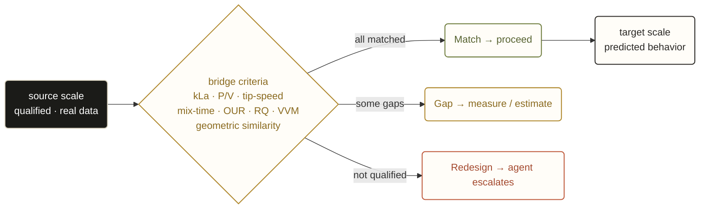

### DoE family selector

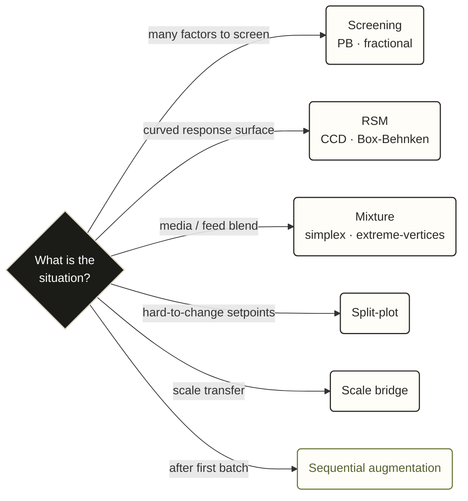

## Start here

This repo is a skill you point a coding agent at. After a one-time local install, Claude Code, Codex CLI, an OpenAI Agents SDK runner, a Symphony worker, or any orchestrator that can read files and run shell commands picks up the skill at [`skills/biosymphony-ferm-doe/SKILL.md`](skills/biosymphony-ferm-doe/SKILL.md) and drives the campaign end to end. You do not need to learn the `ferm-doe` CLI yourself unless you want to.

After cloning, the shortest local smoke test is:

```bash
python3 -m venv .venv && source .venv/bin/activate
python -m pip install -e .
ferm-doe validate examples/demo-pb-screening-public --summary
```

Expected result: `error_count` is `0`; the demo remains `YELLOW` because it is a synthetic planning fixture, not executed lab evidence.

A first run:

1. Install the repo locally (see [Install](#install)).
2. Open the checkout in your coding agent.
3. Paste the prompt from [Run the demo with your agent](#run-the-demo-with-your-agent). The agent checks the design inputs at `examples/demo-pb-screening-public/`, generates a first-batch design, analyzes the bundled synthetic results, plans the follow-up batch, and writes a run packet under `/tmp/demo-pb/`.

When you have a real campaign, pick a job-to-be-done from [`docs/USE_CASES.md`](docs/USE_CASES.md) and an agent harness from [Agent harnesses](#agent-harnesses).

The readiness gate decides what the agent does next: RED blocks, YELLOW proceeds with listed limits, GREEN is worth running:

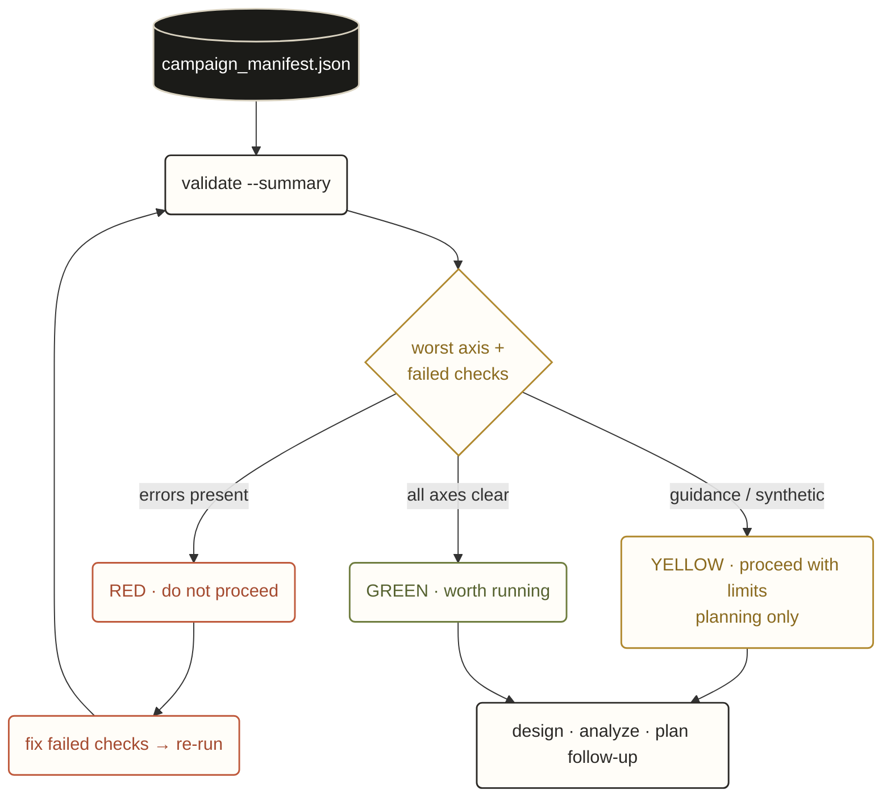

## Popular use cases

| You need to... | Start with |
|---|---|
| Learn the whole validate, design, analyze, follow-up batch, finalize loop | [`examples/demo-pb-screening-public/`](examples/demo-pb-screening-public/) |
| Turn validator warnings into an agent worklist | [`examples/demo-warnings-walkthrough-public/`](examples/demo-warnings-walkthrough-public/) |
| Check a scale-down or scale-up bridge before spending lab time | [`examples/demo-scale-bridge-public/`](examples/demo-scale-bridge-public/) |
| Handle hard-to-change fed-batch factors | [`examples/demo-split-plot-fedbatch-public/`](examples/demo-split-plot-fedbatch-public/) |
| Route constrained media planning through BoFire, ENTMOOT, OMLT, or BoTorch | [`docs/BIOMANUFACTURING_ADAPTIVE_BACKENDS.md`](docs/BIOMANUFACTURING_ADAPTIVE_BACKENDS.md) |
| Generate local issue packs for a longer agent run | [`docs/ISSUE_PACK_COOKBOOK.md`](docs/ISSUE_PACK_COOKBOOK.md) |
| Run a Linear-backed planning program or optional cloud endpoint | [`docs/WORKFLOWS.md`](docs/WORKFLOWS.md) |

See [`docs/USE_CASES.md`](docs/USE_CASES.md) for copy-paste agent requests and the recommended demo for each workflow.

## Agent harnesses

Any coding agent that can read files and run shell commands works. The repo ships ready-to-use configs for the common patterns:

| Harness | Use it when | Read |
|---|---|---|
| Claude Code, repo-local | You want one long-running session iterating on a manifest | [`agents/claude.md`](agents/claude.md) |
| Claude Code + Linear | You want status, ownership, blocked-state escalation, and tracker-safe readiness comments | [`agents/claude.md`](agents/claude.md) + [`agents/linear.md`](agents/linear.md) |
| Codex CLI or OpenAI Agents SDK | You prefer the OpenAI agent runtime, with or without Linear | [`agents/openai.yaml`](agents/openai.yaml) |
| Symphony or other long-horizon orchestrator | You want parallel sub-agents driven by a task queue and tracker | [`agents/generic.md`](agents/generic.md) + [`docs/ISSUE_PACK_COOKBOOK.md`](docs/ISSUE_PACK_COOKBOOK.md) |
| Cloud endpoint (AWS Lambda or Modal) | You want stateless planning commands behind an API | [`deploy/`](deploy/) |
| Hand-driven CLI | You want to drive `ferm-doe` yourself without an agent | [Drive it by hand](#drive-it-by-hand) |

State lives in `campaign_manifest.json` regardless of harness, so sessions pause, resume, and hand off cleanly. The full operating map is in [`docs/WORKFLOWS.md`](docs/WORKFLOWS.md).

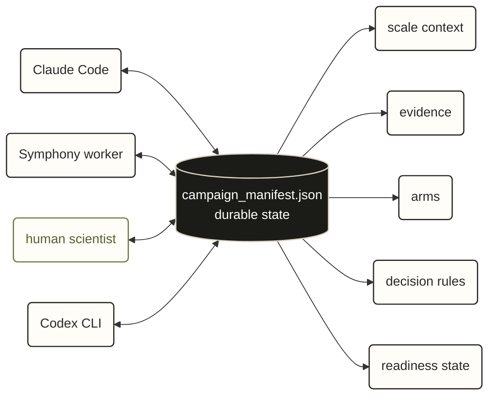

## When to use this

Use this skill when a user, a Linear ticket, or an upstream agent asks you to plan one of the following, and the lab has not yet run the experiment:

- a fermentation or cell-culture screening DoE (microbial, yeast, mammalian, insect)
- a scale-up campaign from bench to pilot or pilot to manufacturing
- a scale-down qualification (build a small-scale model that recapitulates a larger scale)
- a fed-batch or perfusion campaign with hard-to-change setpoints (split-plot)
- a mixture or blend optimization (media composition, feed composition)
- a follow-up batch after a screening identifies active factors
- an assay-readiness review before any of the above

Skip this skill when the lab is mid-run and you need execution tooling (LIMS, ELN, robotics, real-time bioreactor control) or when you need a validated GxP batch-record system. See [`NON_CLAIMS.md`](NON_CLAIMS.md).

## Install

```bash
git clone https://github.com/BioSymphony/ferm-doe.git
cd ferm-doe
python3 -m venv .venv && source .venv/bin/activate
python -m pip install -e .
```

This installs the `ferm-doe` CLI that the agent calls. Optional scientific extras (BoFire, BoTorch, ENTMOOT, OMLT, TabPFN, pyDOE3, SALib, scipy) install separately when a campaign needs them; see [Optional extras](#optional-extras). Adapters degrade to a `not_available` report when the extra is missing, so the demos run on a clean install.

## Run the demo with your agent

Open the checkout in your coding agent (Claude Code, Codex CLI, an OpenAI Agents SDK runner, or any orchestrator that can read files and run shell commands). Paste this prompt:

```text
You are working in the BioSymphony Ferm DoE public repo.

Use the repo-local skill at skills/biosymphony-ferm-doe/SKILL.md.
Keep all work local unless I explicitly ask for a different destination.
Use the fixtures in this checkout or data I provide in the local workspace.
Keep organization-specific inputs in a separate local workspace.

Start with examples/demo-pb-screening-public:
1. Run ferm-doe validate examples/demo-pb-screening-public --summary.
2. Explain the readiness status and failed_check_ids, if any.
3. Generate the first-batch design, analyze the bundled synthetic results, plan the follow-up batch with `plan-wave2`, and finalize a run packet under /tmp/demo-pb.
4. Keep claim levels visible in every generated artifact.
5. Before suggesting that anything is shareable, run `make public-ready`.
```

The agent validates the canonical closed-loop demo, generates a first-batch design, analyzes the bundled synthetic first-batch results, plans a follow-up batch with `plan-wave2`, and finalizes a run packet under `/tmp/demo-pb/`. The generated files are safe to delete. See [`docs/AGENT_QUICKSTART.md`](docs/AGENT_QUICKSTART.md) for the extended version with expected outputs and the agent-loop pattern.

When you are ready to plan your own campaign, ask the agent to copy `templates/campaign_manifest.template.json` and `templates/operator-intake.md` into a separate local workspace, fill them in, and run the same validate / design / analyze / plan-wave2 / finalize loop on the new campaign. Keep private or unpublished inputs out of this public checkout.

At closeout, ask the agent to write a campaign-local handoff at `artifacts/<campaign>/AGENTS.md` and to record hiccups, excluded results, and arm-scoped negative memory in the self-learning ledger and review files. The pattern is documented in [`docs/SELF_LEARNING_DOE.md`](docs/SELF_LEARNING_DOE.md). The artifacts are the portable memory across agent runtimes, so the next session (with the same agent or a different one) resumes from the same file.

## Drive it by hand

You can also drive `ferm-doe` yourself without an agent. The same demo runs as:

```bash
ferm-doe validate examples/demo-pb-screening-public --summary
ferm-doe doctor
ferm-doe generate-design examples/demo-pb-screening-public \
  --out /tmp/demo-pb/wave1_design.csv --seed 0
ferm-doe analyze examples/demo-pb-screening-public \
  --results examples/demo-pb-screening-public/inputs/wave1_results.csv \
  --out /tmp/demo-pb/wave1_analysis.json --seed 0
ferm-doe plan-wave2 examples/demo-pb-screening-public \
  --results examples/demo-pb-screening-public/inputs/wave1_results.csv \
  --out-dir /tmp/demo-pb/wave2 --remaining-budget 3
ferm-doe finalize examples/demo-pb-screening-public \
  --results examples/demo-pb-screening-public/inputs/wave1_results.csv \
  --out /tmp/demo-pb/run_packet.md --json-out /tmp/demo-pb/run_packet.json
```

See [CLI affordances](#cli-affordances) for the full command surface. Contributor and release checks are heavier:

```bash
make release-check
make doctor
make public-ready
```

`make release-check` runs the unit tests, validates every top-level public example with `error_count == 0`, checks the tool registry and adaptive-backend surface, and runs the public-release scanner over the public surface. `make public-ready` adds the required gitleaks history and working-tree secret scan. If `gitleaks` is missing, the public-ready gate fails closed.

## What `validate --summary` looks like

```bash
PYTHONPATH=src python3 -m biosymphony_ferm_doe.cli validate examples/demo-scale-bridge-public --summary
```

```json
{
  "campaign_id": "demo-scale-bridge-public",
  "claim_level": "public_synthetic_demo",
  "error_count": 0,
  "failed_check_ids": [],
  "non_claim": "This validation does not verify physical execution or assay results.",
  "profiles": ["scale_down_qualification"],
  "status": "YELLOW",
  "warning_count": 0,
  "worst_axis": null
}
```

When the manifest is incomplete, the validator surfaces specific guidance instead of failing:

```json
{
  "status": "YELLOW",
  "error_count": 0,
  "warning_count": 8,
  "worst_axis": "general",
  "failed_check_ids": [
    "input-advised-equipment_inventory",
    "profile-advised-block-decision_rules",
    "assay-contract-incomplete_titer",
    "factor-mixture-media_blend",
    "doe-min-runs"
  ]
}
```

A long-running agent reads `failed_check_ids`, fixes them in priority order, re-runs `validate`, and iterates.

Each readiness axis is a gate the campaign must clear before it earns lab time. Any gate can stop it:

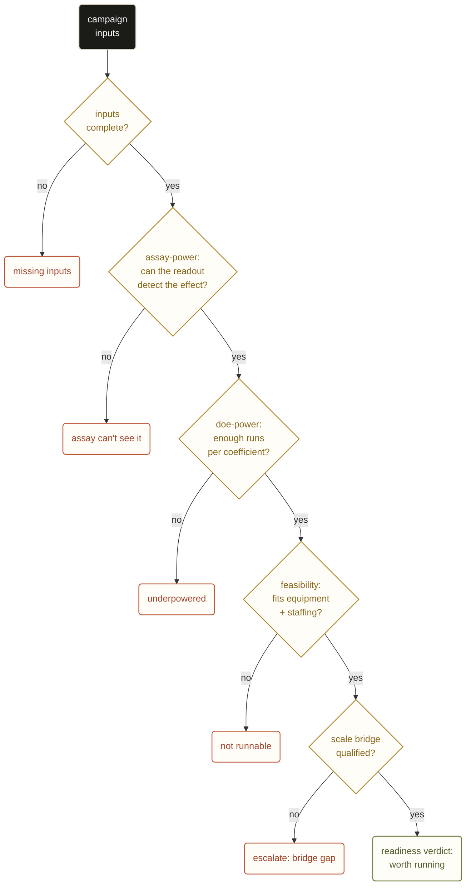

Every generated artifact also carries a `claim_level` that signals how rigorously the rows were produced, so a statistician (or a downstream agent) can decide whether to trust them as-is, review them, or rebuild them.

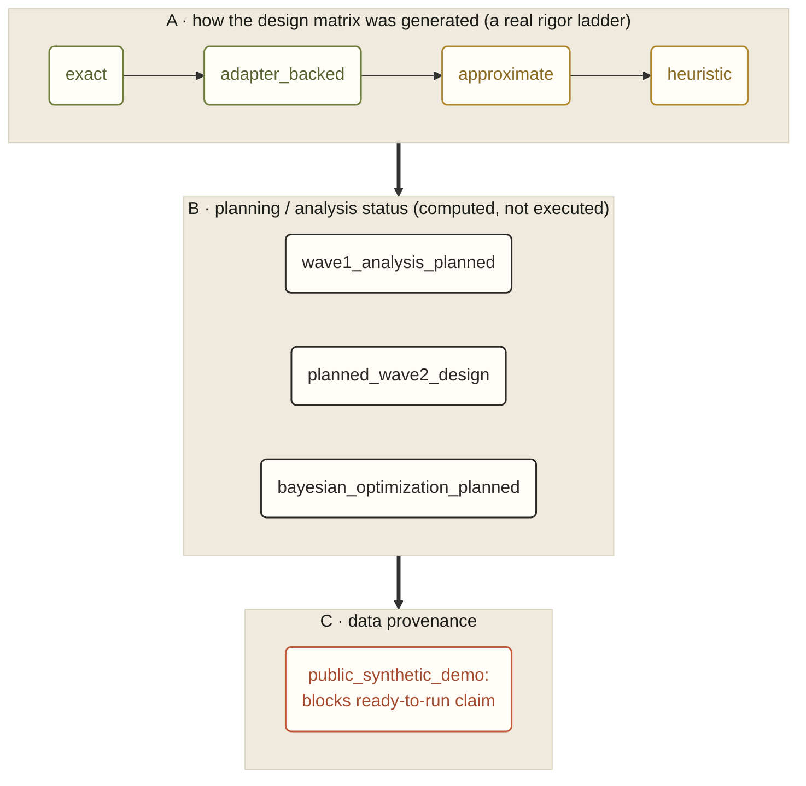

These eight labels live on three axes. **A** is a rigor ladder for how the design matrix was generated, from `exact` down to `heuristic`: an agent that sees `claim_level: heuristic` surfaces the row to a statistician before sealing the campaign. **B** marks planning and analysis outputs that were computed but not executed (the follow-up plan, the BO plan, the first-batch analysis). **C** is a provenance flag: `public_synthetic_demo` blocks any ready-to-run claim.

## How it differs from the alternatives

| | **biosymphony-ferm-doe** | JMP / Design-Expert / Modde | Raw Python (pyDOE3, dexpy) | Working alone in a notebook |
|---|---|---|---|---|
| Input completeness and run-readiness checks | yes | no | no | no |
| Scale-up / scale-down as first-class objects | yes | no | no | sometimes |
| Profile-driven manifest | yes | no | no | no |
| Source-tracked design rationale | yes | no | no | sometimes |
| Long-running-agent loop | yes | no | no | no |
| Cost-model honesty stack | yes | no | no | sometimes |
| Generates DoE designs | yes; full factorial, fractional factorial, Plackett-Burman, definitive screening, central composite, Box-Behnken, simplex-lattice and simplex-centroid mixture, Latin hypercube, D/I-optimal and extreme-vertices (labeled `heuristic`) | yes | yes | sometimes |
| Bayesian optimization for follow-up batches | yes; BoTorch, BoFire, ENTMOOT, OMLT, and TabPFN adapters with documented routing | partial | no | sometimes |
| Constrained mixture or NChooseK | yes; BoFire DoEStrategy plus ENTMOOT/OMLT MIP-backed adapters | yes | no | no |
| Statistical analysis of results | yes; stdlib OLS with permutation p-values, bootstrap CIs, lack-of-fit, half-normal plot data, labeled `wave1_analysis_planned` for statistician review | yes | partial | sometimes |
| GxP-validated | no | varies | no | no |

This is a planning layer that sits above a DoE generator and a statistician. It frames what the campaign needs to learn, what would make it fail, and which measurements, constraints, and scale criteria have to be in place before a design is worth running.

**The design tournament.** It does not emit one design. It generates competing design strategies, scores each against readiness, feasibility, and assay-readiness, and returns the best *runnable* one (or refuses with `no_accepted_design`):

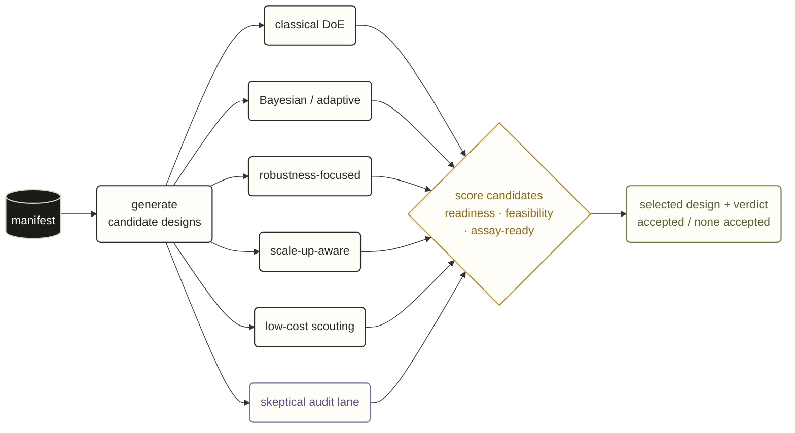

The skeptical audit lane informs scoring but is never selected as the executable design (`tournament.py · run_design_tournament()`).

**The cost-honesty stack.** Cost is reported in five layers, optimistic to fully-loaded, so a number is never quoted without its caveats:

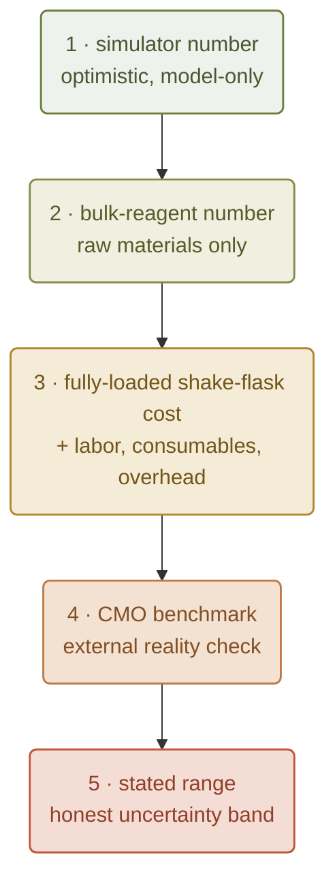

## Demos

Public demos cover the main campaign shapes. The non-BoFire demos run on the stdlib path with zero scientific extras. The BoFire and ENTMOOT demos require their respective optional extras (`pip install biosymphony-ferm-doe[bofire]` or `[entmoot]`); the smoke scripts also run end-to-end without the extras and produce a "not_available" report so the integration shape is testable on any laptop.

| Profile | Demo | What it shows |
|---|---|---|
| `screening` | [`demo-xylanase-public/`](examples/demo-xylanase-public/) | Public xylanase enzyme-production planning; assay-readiness gating; minimum manifest shape |
| `scale_down_qualification` | [`demo-scale-bridge-public/`](examples/demo-scale-bridge-public/) | Pilot 50 L to bench 2 L kLa-matched downscale; multi-arm; full `scale_context` |
| `split_plot_fed_batch` | [`demo-split-plot-fedbatch-public/`](examples/demo-split-plot-fedbatch-public/) | Hard-to-change vs easy-to-change factors; whole-plot ID in design rows |
| `screening` | [`demo-pb-screening-public/`](examples/demo-pb-screening-public/) | 7-factor Plackett-Burman plus 4 center-point replicates; closed-loop walkthrough exercising first-batch design, analysis, `plan-wave2`, and finalize end-to-end with synthetic results bundled |
| `screening` (diagnostic) | [`demo-warnings-walkthrough-public/`](examples/demo-warnings-walkthrough-public/) | Intentionally underspecified manifest that surfaces 8 validator warnings; a worked example of the guidance path |
| BoFire route (light) | [`demo-media-cost-bofire/`](examples/demo-media-cost-bofire/) | Media-cost screening that exercises the BoFire `DoEStrategy` route with linear cost and total-mass constraints |
| BoFire route (scale-bridge) | [`demo-shakeflask-to-2l-bofire/`](examples/demo-shakeflask-to-2l-bofire/) | Shake-flask to 2 L scale-bridge with historical ledger ingest and `MultiFidelityVarianceBasedStrategy` routing notes |
| Multi-arm scale transfer | [`engine-multi-arm-scale-transfer-public/`](examples/engine-multi-arm-scale-transfer-public/) | Coupled plate and reactor planning fixture with per-arm bridge policy |
| Reference DOE | [`reference-doe-custom-design/`](examples/reference-doe-custom-design/) | Custom constrained design fixture for reference-DOE parity checks |
| Public paper starter | [`xylanase-wxz1-2012/`](examples/xylanase-wxz1-2012/) | Public-literature-derived starter dataset normalized into the manifest contract |
| Product-class starter | [`yeast-isoprenoid-2l-fedbatch/`](examples/yeast-isoprenoid-2l-fedbatch/) | Hydrophobic product planning fixture with derived productivity and cost responses |
| ENTMOOT smoke | [`entmoot-nchoosek-smoke/`](examples/entmoot-nchoosek-smoke/) | NChooseK Bayesian optimization via ENTMOOT v2 when BoFire's `SoboStrategy` + `NChooseK` stalls (upstream issue #450) |

## Architecture

The hero loop at the top of this README is the first-run loop. The internal flow is:

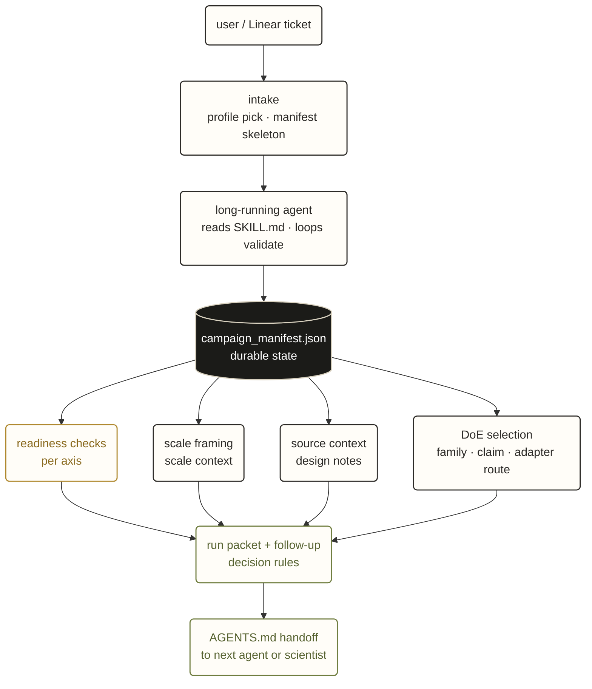

## Documentation

- [`docs/README.md`](docs/README.md): grouped documentation map
- [`docs/GLOSSARY.md`](docs/GLOSSARY.md): short definitions of the terms a newcomer hits in the first ten minutes
- [`docs/CLI_REFERENCE.md`](docs/CLI_REFERENCE.md): single-page index of every `ferm-doe` subcommand
- [`docs/ADAPTER_MAP.md`](docs/ADAPTER_MAP.md): capability-centric map of optional extras and their CLI surfaces
- [`examples/README.md`](examples/README.md): demo chooser and expected validation statuses
- [`docs/AGENT_QUICKSTART.md`](docs/AGENT_QUICKSTART.md): copy-paste prompt and first commands for coding agents
- [`docs/USE_CASES.md`](docs/USE_CASES.md): newcomer workflow chooser and example agent requests
- [`docs/WORKFLOWS.md`](docs/WORKFLOWS.md): local, agent, Linear, issue-pack, and cloud-resource workflow map
- [`docs/ORCHESTRATOR_BOUNDARY.md`](docs/ORCHESTRATOR_BOUNDARY.md): what BioSymphony owns versus what Codex, Claude Code, `/goal`, Symphony, Linear, or cloud runners own
- [`docs/superpowers.md`](docs/superpowers.md): executable capability index and high-value planning moves
- [`docs/PUBLIC_ADOPTION_PATH.md`](docs/PUBLIC_ADOPTION_PATH.md): path from first clone to agent harness to handoff
- [`docs/PUBLIC_SECURITY_MODEL.md`](docs/PUBLIC_SECURITY_MODEL.md): local-first privacy, secret, scanner, and deployment boundaries
- [`docs/RELEASE_READINESS_CHECKLIST.md`](docs/RELEASE_READINESS_CHECKLIST.md): local public-switch checklist
- [`docs/ISSUE_PACK_COOKBOOK.md`](docs/ISSUE_PACK_COOKBOOK.md): local issue-pack commands for agent work graphs
- [`docs/ISSUE_PACK_GENERATION.md`](docs/ISSUE_PACK_GENERATION.md): end-to-end runbook for `engine generate-issue-pack` and orchestrator integration
- [`docs/diagrams/agent-loop-public.mmd`](docs/diagrams/agent-loop-public.mmd): maintainable source for the public agent-loop diagram
- [`skills/biosymphony-ferm-doe/SKILL.md`](skills/biosymphony-ferm-doe/SKILL.md): long-agent loop, refuse-vs-warn rules
- [`docs/PROFILES.md`](docs/PROFILES.md): profile registry and composition
- [`docs/SCALE_BRIDGE.md`](docs/SCALE_BRIDGE.md): scale-bridge framework (criteria, bridge_factors, recapitulation)
- [`docs/SCALE_BRIDGE_METHODOLOGY.md`](docs/SCALE_BRIDGE_METHODOLOGY.md): entry conditions, sulfite kLa calibration, scale-down qualification protocol
- [`docs/DOE_FAMILIES.md`](docs/DOE_FAMILIES.md): supported design families
- [`docs/DOE_FAMILY_RECIPES.md`](docs/DOE_FAMILY_RECIPES.md): manifest-patch recipes for swapping `doe.family`
- [`docs/ADAPTIVE_WAVE2.md`](docs/ADAPTIVE_WAVE2.md): first-batch result ingestion, assay-power checks, and follow-up planning artifacts
- [`docs/WAVE2_BOTORCH.md`](docs/WAVE2_BOTORCH.md): follow-up planning walkthrough with the BoTorch backend (qEI / qUCB)
- [`docs/SELF_LEARNING_DOE.md`](docs/SELF_LEARNING_DOE.md): learning ledger, hiccup review, and arm-scoped negative memory runbook
- [`docs/TOOL_REGISTRY.md`](docs/TOOL_REGISTRY.md): 47-tool BO/DoE and sidecar landscape with positioning and adapter status
- [`docs/BIOMANUFACTURING_ADAPTIVE_BACKENDS.md`](docs/BIOMANUFACTURING_ADAPTIVE_BACKENDS.md): backend-selection surface for BoFire, BayBE, Ax/BoTorch, ENTMOOT, OMLT, and TabPFN
- [`docs/BOFIRE_POSITIONING.md`](docs/BOFIRE_POSITIONING.md): when to route to BoFire and when to stay on stdlib
- [`docs/BOFIRE_CONSTRAINT_PATTERNS.md`](docs/BOFIRE_CONSTRAINT_PATTERNS.md): linear, NChooseK, cardinality patterns, including the `SoboStrategy` + `NChooseK` trap
- [`docs/ENTMOOT_SWAP_DESIGN.md`](docs/ENTMOOT_SWAP_DESIGN.md): ENTMOOT v2 NChooseK adapter design and swap criteria
- [`docs/CONTRACTS.md`](docs/CONTRACTS.md): public task request and design-packet contract checks
- [`docs/SWARMS_AND_EVIDENCE.md`](docs/SWARMS_AND_EVIDENCE.md): source-tracking pattern for design rationale
- [`docs/dossier-generation.md`](docs/dossier-generation.md): how the planning packet is assembled and checked
- [`docs/COST_MODEL_REALISM_CHECK.md`](docs/COST_MODEL_REALISM_CHECK.md): the five-stack cost honesty pattern
- [`docs/OPEN_DATA_PUBLICATION_STRATEGY.md`](docs/OPEN_DATA_PUBLICATION_STRATEGY.md): how a campaign artifact set maps to a publishable open-data drop
- [`docs/SIMULATOR_V2_SPEC.md`](docs/SIMULATOR_V2_SPEC.md): simulator v2 spec (SPEC ONLY; not yet implemented)
- [`docs/AGENT_HARNESSES.md`](docs/AGENT_HARNESSES.md): Claude Code, OpenAI Agents SDK, Codex CLI, Linear-aware runners, generic harnesses
- [`schemas/campaign_manifest.schema.json`](schemas/campaign_manifest.schema.json): JSON Schema for the manifest
- [`schemas/task_request.schema.json`](schemas/task_request.schema.json): JSON Schema for bounded agent task requests
- [`schemas/engine_task_request.schema.json`](schemas/engine_task_request.schema.json): JSON Schema for the richer engine task router
- [`schemas/tables/`](schemas/tables/): Frictionless-compatible table contracts (run ledger, evidence, equipment, reagent, design, results)
- [`NON_CLAIMS.md`](NON_CLAIMS.md): scope and boundary statements
- [`CHANGELOG.md`](CHANGELOG.md): release history
- [`CONTRIBUTING.md`](CONTRIBUTING.md): how to add profiles, families, demos
- [`agents/`](agents/): runtime-specific agent configs (Claude, OpenAI, generic, Linear)

## Agent harness integration

The skill is runtime-agnostic. State lives in `<campaign_dir>/campaign_manifest.json`. Agents update it across turns. The CLI is stdlib-only at runtime; optional scientific dependencies route through adapters that degrade cleanly to a "not_available" report when missing.

- **Repo-local skill**: point a coding agent at [`skills/biosymphony-ferm-doe/SKILL.md`](skills/biosymphony-ferm-doe/SKILL.md). Keep it repo-local or workflow-scoped rather than installed as a global always-on behavior. This is the primary path.
- **Hand-driven CLI**: run `ferm-doe ...` directly from a clone. Useful for a single one-shot check, a scripted pipeline step, or a scientist who wants to drive the planning loop manually.
- **Harness configs**: use [`agents/`](agents/) when an orchestrator owns task routing, state, and review.
- **Claude Code plus Linear**: see [`agents/claude.md`](agents/claude.md) and [`agents/linear.md`](agents/linear.md). Pattern: Linear issue maps to `campaign_id`; tracker-safe readiness fields land as a Linear comment; `stop_rule` firing escalates the issue.
- **OpenAI Agents SDK / Codex CLI plus Linear**: see [`agents/openai.yaml`](agents/openai.yaml) and [`agents/linear.md`](agents/linear.md). Same pattern, different runtime.
- **Generic long-horizon orchestrators**: see [`agents/generic.md`](agents/generic.md). The skill works wherever the agent can read and write the manifest file and shell out to `python3 -m biosymphony_ferm_doe.cli`.

For multi-agent campaigns, the issue-pack contract lets an orchestrator fan work to parallel sub-agents and converge the results into one review packet, with the manifest as the durable spine:

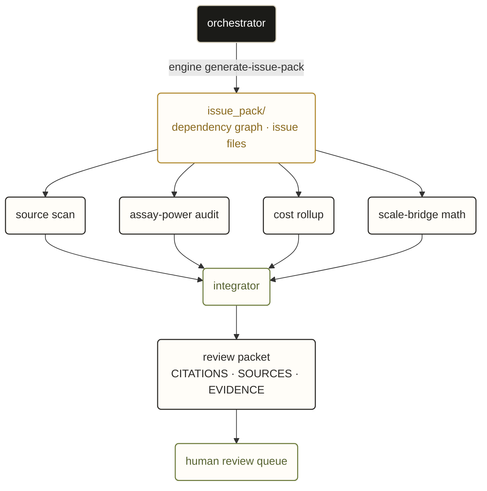

The full runbook is in [`docs/ISSUE_PACK_GENERATION.md`](docs/ISSUE_PACK_GENERATION.md); pack chooser and copy-paste recipes live in [`docs/ISSUE_PACK_COOKBOOK.md`](docs/ISSUE_PACK_COOKBOOK.md).

## CLI affordances

A single-page index of every `ferm-doe` subcommand, grouped by lifecycle stage, is at [`docs/CLI_REFERENCE.md`](docs/CLI_REFERENCE.md). The snippets below are the most useful one-liners.

```bash
# short summary instead of the full check list
ferm-doe validate examples/demo-scale-bridge-public --summary

# write JSON to a file instead of stdout (good for agent pipes)
ferm-doe validate examples/demo-scale-bridge-public --out /tmp/result.json

# validate a bounded agent task request
ferm-doe validate-task-request templates/task_request.template.json

# route a richer engine task request
ferm-doe engine route-task-request templates/engine_task_request.template.json

# check the compact public design-packet contract surface
ferm-doe check-dossier examples/demo-xylanase-public

# evaluate response-level assay-power assumptions
ferm-doe assay-power examples/demo-xylanase-public

# recommend a DoE family from the manifest
ferm-doe recommend-family examples/demo-xylanase-public

# generate the first-batch design from the manifest's `doe.family`
ferm-doe generate-design examples/demo-xylanase-public \
  --out /tmp/wave1_design.csv \
  --metadata-out /tmp/wave1_design.metadata.json \
  --seed 0

# derive an engineering recipe at to_scale (RPM, sparge, agitator power, kLa)
ferm-doe scale-recipe examples/demo-scale-bridge-public \
  --out /tmp/scale_recipe.json \
  --md-out /tmp/scale_recipe.md

# formulate Derringer-Suich desirability goals from responses and decision_rules
ferm-doe goals examples/demo-xylanase-public --out /tmp/goals.json

# design-level power analysis (per-coefficient MDE)
ferm-doe doe-power examples/demo-xylanase-public --sigma 0.5

# sampling schedule for fed-batch / perfusion runs
ferm-doe sampling-plan examples/demo-scale-bridge-public \
  --out /tmp/sampling.csv \
  --md-out /tmp/sampling.md

# cost / resource rollup against operator-declared unit costs
ferm-doe cost-rollup examples/demo-xylanase-public --out /tmp/cost.json

# fit OLS to first-batch results: effect estimates, permutation p-values, lack-of-fit
ferm-doe analyze examples/demo-pb-screening-public \
  --results examples/demo-pb-screening-public/inputs/wave1_results.csv \
  --out /tmp/analysis.json \
  --md-out /tmp/analysis.md \
  --seed 0

# compose every available artifact into one shippable run-packet markdown
ferm-doe finalize examples/demo-pb-screening-public \
  --out /tmp/run_packet.md \
  --json-out /tmp/run_packet.json \
  --results examples/demo-pb-screening-public/inputs/wave1_results.csv

# plan the follow-up batch from first-batch result rows (stdlib closed-loop)
ferm-doe plan-wave2 examples/demo-pb-screening-public \
  --results examples/demo-pb-screening-public/inputs/wave1_results.csv \
  --out-dir wave2_public_plan \
  --remaining-budget 3

# plan the follow-up batch with BoTorch (Gaussian-process surrogate + acquisition)
# Full walkthrough: docs/WAVE2_BOTORCH.md
ferm-doe plan-wave2 examples/demo-pb-screening-public \
  --results examples/demo-pb-screening-public/inputs/wave1_results.csv \
  --out-dir wave2_bo_plan \
  --backend botorch \
  --acquisition qei \
  --bo-n-candidates 6

# full local engine commands live behind the engine subcommand
ferm-doe engine compile-state \
  --manifest examples/reference-doe-custom-design/campaign_manifest.json \
  --out /tmp/ferm-doe-state
ferm-doe engine compile-dossier \
  --manifest examples/yeast-isoprenoid-2l-fedbatch/campaign_manifest.json \
  --out /tmp/ferm-doe-dossier \
  --run-budget 16
ferm-doe engine utility check-deps

# audit-skip marker on a line names the specific release rule to ignore
# api_key=PLACEHOLDER_NEVER_COMMIT  # audit-skip: assigned_secret_like_value documentation example
```

## Optional extras

Install only what your campaign needs. Each extra is independently routable; the skill falls back to a stdlib path when the extra is absent. For a capability-centric view ("I want to do X, which extra activates it"), see [`docs/ADAPTER_MAP.md`](docs/ADAPTER_MAP.md). For honest depth on each backend (quantitative leak counts, OMLT-supersedes-ENTMOOT, BoFire main currency note), see [`docs/BACKEND_EVAL_FINDINGS.md`](docs/BACKEND_EVAL_FINDINGS.md); for the load-bearing adapter design decisions (encodings, posterior wraps, optimizer knobs), see [`docs/ADAPTER_DESIGN_NOTES.md`](docs/ADAPTER_DESIGN_NOTES.md).

Which engine for which problem:

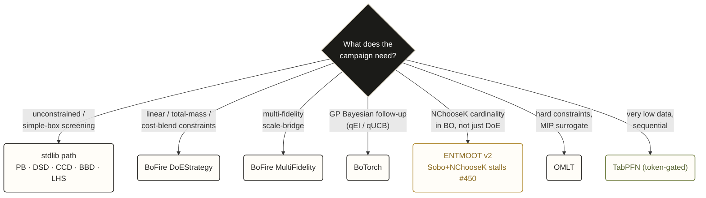

| Extra | Install | Adds |
|---|---|---|
| `scipy` | `pip install biosymphony-ferm-doe[scipy]` | Student-t p-values in `analyze`; t-quantile in `doe-power` |
| `pydoe3` | `pip install biosymphony-ferm-doe[pydoe3]` | Box-Behnken for k >= 5 and maximin Latin Hypercube |
| `botorch` | `pip install biosymphony-ferm-doe[botorch]` | Gaussian-process Bayesian optimization for follow-up planning in `plan-wave2` |
| `bofire` | `pip install biosymphony-ferm-doe[bofire]` | `DoEStrategy`, `SoboStrategy`, `MultiFidelityVarianceBasedStrategy` routing for constrained DoE and BO |
| `entmoot` | `pip install biosymphony-ferm-doe[entmoot]` | NChooseK Bayesian optimization via ENTMOOT v2 (cardinality-aware) |
| `omlt` | `pip install biosymphony-ferm-doe[omlt]` | MIP-optimized surrogate planning over linear and NChooseK constraints |
| `tabpfn` | `pip install biosymphony-ferm-doe[tabpfn]` | Token-gated foundation-model surrogate route for low-data sequential planning |
| `backend-eval` | `pip install biosymphony-ferm-doe[backend-eval]` | BayBE and Ax imports for backend comparison fixtures |
| `sensitivity` | `pip install biosymphony-ferm-doe[sensitivity]` | SALib sensitivity analysis on result rows |
| `report` | `pip install biosymphony-ferm-doe[report]` | Plotly figures in the BoFire HTML report |
| `contracts` | `pip install biosymphony-ferm-doe[contracts]` | Frictionless validation of table contracts |

## FAQ

**Q. Does this generate DoE designs?**
A. Yes. `ferm-doe generate-design` emits a first-batch design CSV directly from the campaign manifest, stdlib only, no external generator required. Supported families and claim levels: `full_factorial`, `fractional_factorial`, `plackett_burman` (n in {8, 12, 16, 20, 24}), `definitive_screening` (k in {3..6, 9, 10}), `central_composite` (face-centered, rotatable, orthogonal), `box_behnken` (k in {3, 4}), `latin_hypercube`, and `scheffe_mixture` are emitted at `claim_level: exact`. `optimal_d`, `optimal_i`, and `extreme_vertices_mixture` use coordinate exchange or constraint enumeration and are labeled `heuristic`; review with a statistician before expensive runs. Follow-up candidate rows come from `ferm-doe plan-wave2` under `claim_level: planned_wave2_design`. Every row in every output carries the claim level so a statistician can see exactly how rigorously the matrix was produced.

**Q. Does this adapt after the first batch?**
A. Yes, in planning mode. `ferm-doe plan-wave2` joins trusted, QC-passing result rows, evaluates assay-power policy, writes negative memory and learning artifacts, and recommends `confirm`, `narrow`, `expand`, `pause`, `stop`, or a bridge-gated `scale_or_downscale` plan for the next experiment round. With `--backend botorch`, it routes through a Gaussian-process surrogate and an acquisition function (qEI or qUCB) for `n_candidates` follow-up points. Outputs are labeled `planned_wave2_design` or `bayesian_optimization_planned`, not validated optimization. The next batch is chosen from the data, not pre-scripted:

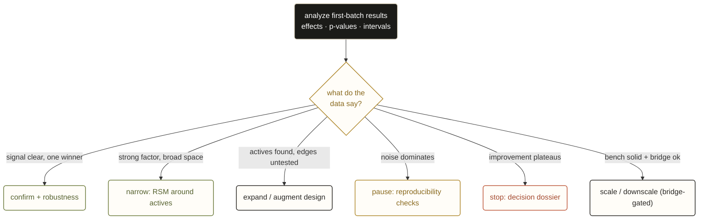

**Q. When do I route to BoFire vs the stdlib path?**
A. See [`docs/BOFIRE_POSITIONING.md`](docs/BOFIRE_POSITIONING.md). Short version: stdlib for unconstrained or simple-box screening and adaptive follow-up planning; BoFire for linear or nonlinear constraint blends (cost, total-mass, NChooseK) and for multi-fidelity scale-bridge planning. The BoFire adapter degrades to a "not_available" report when the extra is absent, so smoke scripts run on any laptop.

**Q. When do I route to ENTMOOT instead of BoFire?**
A. When NChooseK cardinality is load-bearing in Bayesian optimization (not just initial DoE). BoFire's `SoboStrategy` plus `NChooseK` stalls indefinitely (upstream issue #450). ENTMOOT v2 with `min_count` constraints is the documented swap. See [`docs/ENTMOOT_SWAP_DESIGN.md`](docs/ENTMOOT_SWAP_DESIGN.md).

**Q. What about BayBE, Ax, OMLT, and TabPFN?**
A. They are optional evaluation routes that keep the campaign manifest as the source of state. See [`docs/BIOMANUFACTURING_ADAPTIVE_BACKENDS.md`](docs/BIOMANUFACTURING_ADAPTIVE_BACKENDS.md). BoFire remains the default constrained static DoE/BO route. BayBE is a low-data and hybrid-space comparison target; Ax/BoTorch is for custom modeling or trial lifecycle pilots; OMLT is a MIP-surrogate route for hard constraints; TabPFN is a token-gated low-data surrogate experiment.

**Q. Why is the verdict YELLOW for the demos?**
A. The demos use synthetic placeholder data with `readiness_expectation: YELLOW`. The verdict reflects that the demos are pre-experiment plans on synthetic inputs; the schema carries that readiness caveat through to anything consuming the manifest. The diagnostic walkthrough demo additionally exercises the validator's guidance path.

**Q. Can I use this for mammalian cell culture, not just microbial fermentation?**
A. Yes. The schema is organism-agnostic. Scale-bridge criteria like P/V and tip speed are common for shear-sensitive mammalian work; kLa is more common for microbial. See [`docs/SCALE_BRIDGE.md`](docs/SCALE_BRIDGE.md).

**Q. How is this different from a Jupyter notebook with pyDOE3?**
A. Notebooks generate designs but do not gate readiness or carry durable state for a long-running agent. This repo is the manifest layer that sits above a notebook or commercial DoE tool, plus the literature-aware planning loop, plus the readiness gates.

**Q. Is the skill stateful or stateless?**
A. The skill itself is stateless. State lives in the campaign manifest file. The agent that uses the skill is responsible for persisting and updating that file across turns.

**Q. Does this work without an agent?**
A. Yes. The CLI runs standalone, and a scientist can call `ferm-doe validate`, `generate-design`, `analyze`, `plan-wave2`, and `finalize` directly. The repo is designed around agent harnesses because that is where multi-turn campaign state, parallel sub-agent dispatch, and cross-session handoff actually pay off, but the individual commands are useful on their own.

**Q. What about GxP / regulatory contexts?**
A. GxP batch records require a separately-validated execution pipeline. This tool covers the planning step that feeds one. See [`NON_CLAIMS.md`](NON_CLAIMS.md).

**Q. Can I use private data with this skill?**
A. Yes, but keep private campaigns in a separate non-public workspace and do not commit them here. `claim_level` is a provenance label, not a sanitization control; scanners, release checks, and secret checks still apply before anything is shared.

**Q. What does "long-running agent" mean concretely?**
A. An agent session that spans hours or days, accumulates context, may pause and resume, and may hand off to other agents or humans. Examples: a Claude Code session driving a multi-week design effort; a Codex worker that tracks a Linear project; a custom orchestrator running between waves.

## Status

Pre-alpha (`0.1.0a0`). The schema is intentionally permissive at unknown-key boundaries (`additionalProperties: true` throughout); validators emit guidance, not gating, except for structural contradictions and release-blocking public artifacts. Long-running agents should call `validate --summary` between turns and read the full output when fixing.

## Contributing

See [`CONTRIBUTING.md`](CONTRIBUTING.md). Public-safe synthetic demos are welcome; do not include private process data in this repo.

## Pitch

In bioprocess work, the expensive failure is the well-formatted experiment that cannot answer its scientific question.

`biosymphony-ferm-doe` checks whether a fermentation campaign is measurable, runnable, and worth running before the lab spends time and materials.

## License

[MIT](LICENSE).

## Related work

- [Garcia-Ochoa & Gomez 2009](https://doi.org/10.1016/j.biotechadv.2008.10.006): kLa review (cited in the scale-bridge demo)
- [Junker 2004](https://doi.org/10.1263/jbb.97.347): scale-up review
- [Jones & Nachtsheim 2011](https://www.tandfonline.com/doi/abs/10.1080/00224065.2011.11917841): Definitive Screening Designs
- [Jones & Nachtsheim 2009](https://doi.org/10.1080/00224065.2009.11917782): split-plot guidance
- [Studier 2005](https://doi.org/10.1016/j.pep.2005.01.016): lactose autoinduction

## Topics

`fermentation` `bioprocess` `biomanufacturing` `bioreactor` `cell-culture` `fed-batch` `perfusion` `design-of-experiments` `experimental-design` `doe` `bayesian-optimization` `optimization` `scale-up` `scale-down` `kla` `python` `biosafety` `agentic-ai` `ai-agents` `claude-code`
