# BioSymphony Ferm DoE

BioSymphony Ferm DoE is a toolkit for planning fermentation experiments with design of experiments (DoE). It produces design tables, measurement readiness reports, follow-up plans, and run packets.

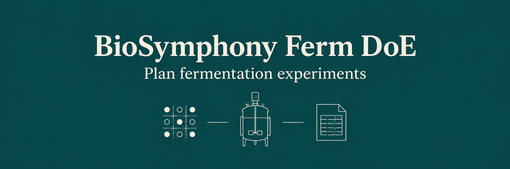

[](https://github.com/BioSymphony/ferm-doe/actions/workflows/ci.yml)
[](LICENSE)
[](https://www.python.org/downloads/)
[](#status)

Use the `ferm-doe` command line or a coding agent that can read files and run commands. A `campaign_manifest.json` records the objective, responses, factors, constraints, and evidence references so another person or agent can continue the work.

Outputs are planning artifacts for scientific review. Lab execution and experimental validation remain separate; see [scope and limitations](NON_CLAIMS.md).

## Start Here

In a cloned checkout, create a virtual environment and validate the synthetic screening demo:

```bash
python3 -m venv .venv
source .venv/bin/activate
python -m pip install -e .
ferm-doe validate examples/demo-pb-screening-public --summary
```

Expected result: `error_count: 0` and `status: YELLOW`. The demo uses synthetic data to demonstrate planning checks.

Continue with the [agent demo prompt](#run-the-demo-with-your-agent) or the [manual CLI walkthrough](#drive-it-by-hand). For other tasks, choose a [use case](docs/USE_CASES.md). See [Install](#install) for clone commands and optional dependencies.

## Planning Workflow

1. Define the objective, measured responses, factors, constraints, and scale context in `campaign_manifest.json`.
2. Check the inputs and measurement requirements, resolve blocking errors, and generate a design table.
3. Analyze supplied results, propose a follow-up batch, and write a run packet with source references and claim labels.

The `wave1` and `wave2` artifact names identify the first-batch and follow-up checkpoints. Results determine the next planning step.

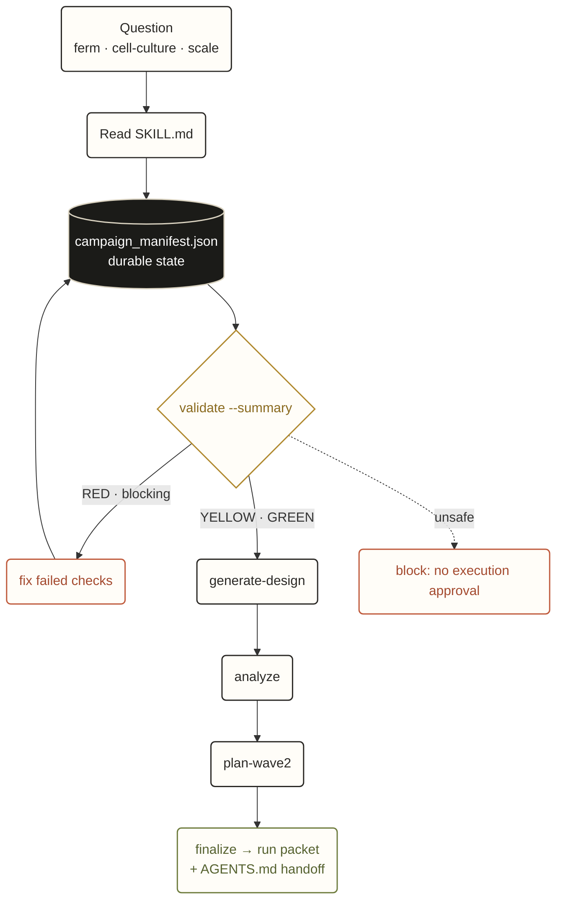
```mermaid
flowchart TB
  Q("Question<br/>ferm · cell-culture · scale"):::proc --> S("Read SKILL.md"):::proc --> M[("campaign_manifest.json<br/>durable state")]:::hero --> V{"validate --summary"}:::gate
  V -->|"RED · blocking"| FIX("fix failed checks"):::block
  FIX --> M
  V -->|"YELLOW · GREEN"| D("generate-design"):::proc --> A("analyze"):::proc --> P("plan-wave2"):::proc --> F("finalize → run packet<br/>+ AGENTS.md handoff"):::go
  V -.->|"unsafe"| BLK("block: no execution approval"):::block
  classDef hero fill:#1b1b18,stroke:#d9d2c0,color:#ffffff,stroke-width:1.5px;
  classDef proc fill:#fffdf8,stroke:#2b2926,color:#2b2926,stroke-width:1.5px;
  classDef gate fill:#fffdf8,stroke:#b0892f,color:#8a6a1f,stroke-width:1.5px;
  classDef go fill:#fffdf8,stroke:#6f7d3f,color:#566230,stroke-width:1.5px;
  classDef block fill:#fffdf8,stroke:#bf5a3c,color:#a44a2f,stroke-width:1.5px;
```

## Planning Capabilities

- Generate classical designs with the base package; use optional adapters for constrained designs and Bayesian follow-up. The [tool registry](docs/TOOL_REGISTRY.md) distinguishes implemented adapters from evaluation candidates.
- Record scale-transfer criteria such as oxygen transfer, power per volume, tip speed, and mixing time in the [scale context](docs/SCALE_BRIDGE.md).
- Compare simulator estimates, reagent costs, labor and overhead, and contract manufacturing benchmarks with the [cost-model reporting template](docs/COST_MODEL_REALISM_CHECK.md).
- Divide longer campaigns into bounded [issue packs](docs/ISSUE_PACK_GENERATION.md), preserve source references, and write handoff files for the next session.

## Popular Use Cases

| You need to... | Start with |
|---|---|
| Learn the whole validate, design, analyze, follow-up batch, finalize loop | [`examples/demo-pb-screening-public/`](examples/demo-pb-screening-public/) |
| Turn validator warnings into an agent worklist | [`examples/demo-warnings-walkthrough-public/`](examples/demo-warnings-walkthrough-public/) |
| Check a scale-down or scale-up bridge before spending lab time | [`examples/demo-scale-bridge-public/`](examples/demo-scale-bridge-public/) |
| Handle hard-to-change fed-batch factors | [`examples/demo-split-plot-fedbatch-public/`](examples/demo-split-plot-fedbatch-public/) |
| Route constrained media planning through BoFire, ENTMOOT, OMLT, or BoTorch | [`docs/BIOMANUFACTURING_ADAPTIVE_BACKENDS.md`](docs/BIOMANUFACTURING_ADAPTIVE_BACKENDS.md) |
| Generate local issue packs for a longer agent run | [`docs/ISSUE_PACK_COOKBOOK.md`](docs/ISSUE_PACK_COOKBOOK.md) |
| Run a Linear-backed planning program or optional cloud endpoint | [`docs/WORKFLOWS.md`](docs/WORKFLOWS.md) |

See [`docs/USE_CASES.md`](docs/USE_CASES.md) for copy-paste agent requests and the recommended demo for each workflow.

## Agent Harnesses

Choose an agent integration or run the CLI directly. The repository includes configuration examples for these workflows:

| Harness | Use it when | Read |
|---|---|---|
| Claude Code, repo-local | You want one long-running session iterating on a manifest | [`agents/claude.md`](agents/claude.md) |
| Claude Code + Linear | You want status, ownership, blocked-state escalation, and tracker-safe readiness comments | [`agents/claude.md`](agents/claude.md) + [`agents/linear.md`](agents/linear.md) |
| Codex CLI or OpenAI Agents SDK | You prefer the OpenAI agent runtime, with or without Linear | [`agents/openai.yaml`](agents/openai.yaml) |
| Symphony or other long-horizon orchestrator | You want parallel sub-agents driven by a task queue and tracker | [`agents/generic.md`](agents/generic.md) + [`docs/ISSUE_PACK_COOKBOOK.md`](docs/ISSUE_PACK_COOKBOOK.md) |
| Cloud endpoint (AWS Lambda or Modal) | You want stateless planning commands behind an API | [`deploy/`](deploy/) |
| Hand-driven CLI | You want to drive `ferm-doe` yourself without an agent | [Drive it by hand](#drive-it-by-hand) |

See [Workflows](docs/WORKFLOWS.md) for state ownership and handoff conventions.

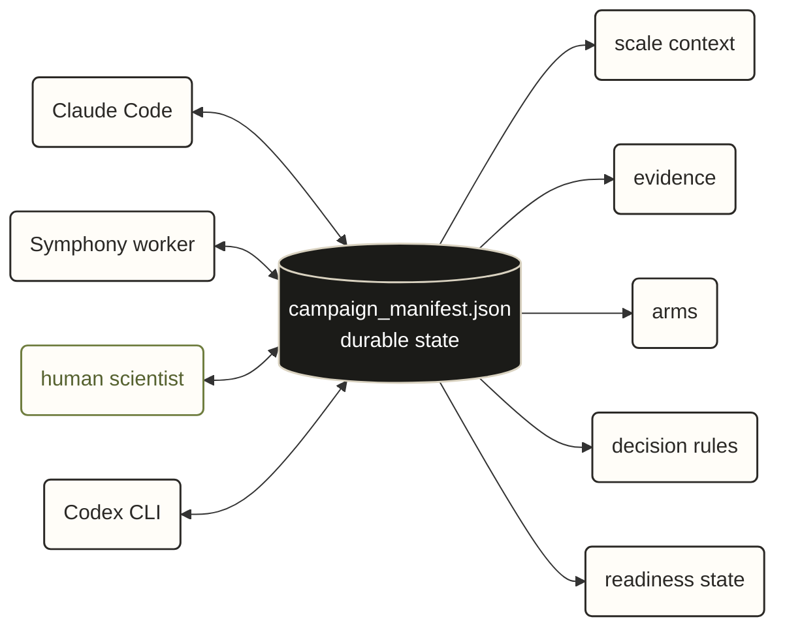
```mermaid
flowchart LR
  A1("Claude Code"):::proc
  A2("Symphony worker"):::proc
  H("human scientist"):::go
  A3("Codex CLI"):::proc
  M[("campaign_manifest.json<br/>durable state")]:::hero
  A1 <--> M
  A2 <--> M
  H <--> M
  A3 <--> M
  M --> S1("scale context"):::proc
  M --> S2("evidence"):::proc
  M --> S3("arms"):::proc
  M --> S4("decision rules"):::proc
  M --> S5("readiness state"):::proc
  classDef hero fill:#1b1b18,stroke:#d9d2c0,color:#ffffff,stroke-width:1.5px;
  classDef proc fill:#fffdf8,stroke:#2b2926,color:#2b2926,stroke-width:1.5px;
  classDef go fill:#fffdf8,stroke:#6f7d3f,color:#566230,stroke-width:1.5px;
```

## When To Use This

Use this skill when a user, a Linear ticket, or an upstream agent asks you to plan one of the following, and the lab has not yet run the experiment:

- a fermentation or cell-culture screening DoE (microbial, yeast, mammalian, insect)
- a scale-up campaign from bench to pilot or pilot to manufacturing
- a scale-down qualification (build a small-scale model that recapitulates a larger scale)
- a fed-batch or perfusion campaign with hard-to-change setpoints (split-plot)
- a mixture or blend optimization (media composition, feed composition)
- a follow-up batch after a screening identifies active factors
- an assay-readiness review before any of the above

Skip this skill when the lab is mid-run and you need execution tooling (LIMS, ELN, robotics, real-time bioreactor control) or when you need a validated GxP batch-record system. See [`NON_CLAIMS.md`](NON_CLAIMS.md).

## Install

```bash
git clone https://github.com/BioSymphony/ferm-doe.git
cd ferm-doe
python3 -m venv .venv && source .venv/bin/activate
python -m pip install -e .
```

This installs the `ferm-doe` CLI that the agent calls. Optional scientific extras (BoFire, BoTorch, ENTMOOT, OMLT, TabPFN, pyDOE3, SALib, scipy) install separately when a campaign needs them; see [Optional extras](#optional-extras). Adapters degrade to a `not_available` report when the extra is missing, so the demos run on a clean install.

## Run The Demo With Your Agent

Open the checkout in your coding agent (Claude Code, Codex CLI, an OpenAI Agents SDK runner, or any orchestrator that can read files and run shell commands). Paste this prompt:

```text
You are working in the BioSymphony Ferm DoE public repo.

Use the repo-local skill at skills/biosymphony-ferm-doe/SKILL.md.
Keep all work local unless I explicitly ask for a different destination.
Use the fixtures in this checkout or data I provide in the local workspace.
Keep organization-specific inputs in a separate local workspace.

Start with examples/demo-pb-screening-public:
1. Run ferm-doe validate examples/demo-pb-screening-public --summary.
2. Explain the readiness status and failed_check_ids, if any.
3. Generate the first-batch design, analyze the bundled synthetic results, plan the follow-up batch with `plan-wave2`, and finalize a run packet under /tmp/demo-pb.
4. Keep claim levels visible in every generated artifact.
5. Before suggesting that anything is shareable, run `make public-ready`.
```

The demo writes disposable outputs under `/tmp/demo-pb/`. The [agent quickstart](docs/AGENT_QUICKSTART.md) lists the commands and expected artifacts.

When you are ready to plan your own campaign, ask the agent to copy `templates/campaign_manifest.template.json` and `templates/operator-intake.md` into a separate local workspace, fill them in, and run the same validate / design / analyze / plan-wave2 / finalize loop on the new campaign. Keep private or unpublished inputs out of this public checkout.

At closeout, ask the agent to write a campaign-local handoff at `artifacts/<campaign>/AGENTS.md` and to record hiccups, excluded results, and arm-scoped negative memory in the self-learning ledger and review files. The pattern is documented in [`docs/SELF_LEARNING_DOE.md`](docs/SELF_LEARNING_DOE.md). The artifacts are the portable memory across agent runtimes, so the next session (with the same agent or a different one) resumes from the same file.

## Drive It By Hand

You can also drive `ferm-doe` yourself without an agent. The same demo runs as:

```bash
ferm-doe validate examples/demo-pb-screening-public --summary
ferm-doe doctor
ferm-doe generate-design examples/demo-pb-screening-public \
  --out /tmp/demo-pb/wave1_design.csv --seed 0
ferm-doe analyze examples/demo-pb-screening-public \
  --results examples/demo-pb-screening-public/inputs/wave1_results.csv \
  --out /tmp/demo-pb/wave1_analysis.json --seed 0
ferm-doe plan-wave2 examples/demo-pb-screening-public \
  --results examples/demo-pb-screening-public/inputs/wave1_results.csv \
  --out-dir /tmp/demo-pb/wave2 --remaining-budget 3
ferm-doe finalize examples/demo-pb-screening-public \
  --results examples/demo-pb-screening-public/inputs/wave1_results.csv \
  --out /tmp/demo-pb/run_packet.md --json-out /tmp/demo-pb/run_packet.json
```

See [CLI Commands](#cli-commands) for more examples. To check a contribution before sharing it, run:

```bash
make release-check
make doctor
make public-ready
```

`make release-check` runs the unit tests, validates every top-level public example with `error_count == 0`, checks the tool registry and adaptive-backend surface, and runs the public-release scanner over the public surface. `make public-ready` adds the required gitleaks history and working-tree secret scan. If `gitleaks` is missing, the public-ready gate fails closed.

## What `validate --summary` Looks Like

```bash
PYTHONPATH=src python3 -m biosymphony_ferm_doe.cli validate examples/demo-scale-bridge-public --summary
```

```json
{
  "campaign_id": "demo-scale-bridge-public",
  "claim_level": "public_synthetic_demo",
  "error_count": 0,
  "failed_check_ids": [],
  "non_claim": "This validation does not verify physical execution or assay results.",
  "profiles": ["scale_down_qualification"],
  "status": "YELLOW",
  "warning_count": 0,
  "worst_axis": null
}
```

Advisory gaps produce warnings such as these. Missing required fields and structural contradictions can produce blocking errors:

```json
{
  "status": "YELLOW",
  "error_count": 0,
  "warning_count": 8,
  "worst_axis": "general",
  "failed_check_ids": [
    "input-advised-equipment_inventory",
    "profile-advised-block-decision_rules",
    "assay-contract-incomplete_titer",
    "factor-mixture-media_blend",
    "doe-min-runs"
  ]
}
```

A long-running agent reads `failed_check_ids`, fixes them in priority order, re-runs `validate`, and iterates.

Each readiness axis is a review checkpoint. The summary helps the agent decide what needs attention before the campaign is considered for lab time. A blocking error can stop progress:

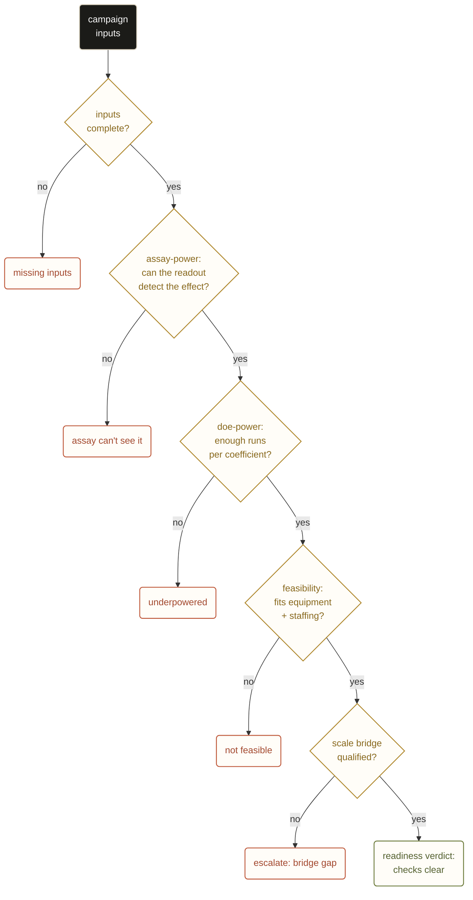
```mermaid
flowchart TB
  IN("campaign<br/>inputs"):::hero --> G1{"inputs<br/>complete?"}:::gate
  G1 -->|"no"| X1("missing inputs"):::block
  G1 -->|"yes"| G2{"assay-power:<br/>can the readout<br/>detect the effect?"}:::gate
  G2 -->|"no"| X2("assay can't see it"):::block
  G2 -->|"yes"| G3{"doe-power:<br/>enough runs<br/>per coefficient?"}:::gate
  G3 -->|"no"| X3("underpowered"):::block
  G3 -->|"yes"| G4{"feasibility:<br/>fits equipment<br/>+ staffing?"}:::gate
  G4 -->|"no"| X4("not feasible"):::block
  G4 -->|"yes"| G5{"scale bridge<br/>qualified?"}:::gate
  G5 -->|"no"| X5("escalate: bridge gap"):::block
  G5 -->|"yes"| OK("readiness verdict:<br/>checks clear"):::go
  classDef hero fill:#1b1b18,stroke:#d9d2c0,color:#ffffff,stroke-width:1.5px;
  classDef gate fill:#fffdf8,stroke:#b0892f,color:#8a6a1f,stroke-width:1.5px;
  classDef go fill:#fffdf8,stroke:#6f7d3f,color:#566230,stroke-width:1.5px;
  classDef block fill:#fffdf8,stroke:#bf5a3c,color:#a44a2f,stroke-width:1.5px;
```

Every generated artifact also carries a `claim_level` that signals how rigorously the rows were produced, so a statistician (or a downstream agent) can review them, use them with stated limits, or rebuild them.

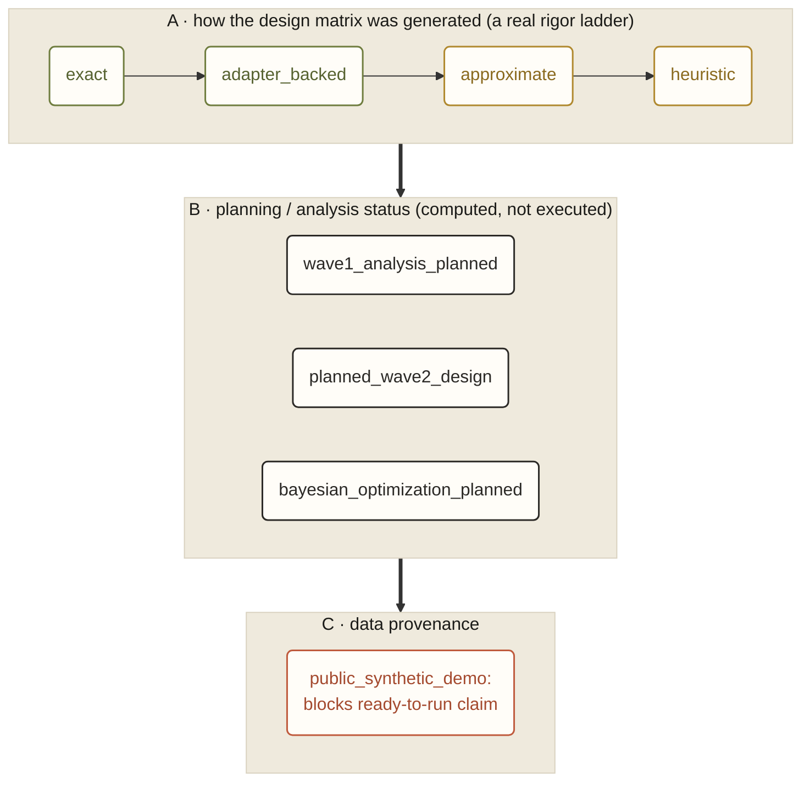
```mermaid
flowchart TB
  subgraph GEN["A · how the design matrix was generated  (a real rigor ladder)"]
    direction LR
    g1("exact"):::go --> g2("adapter_backed"):::go --> g3("approximate"):::gate --> g4("heuristic"):::gate
  end
  subgraph STAT["B · planning / analysis status  (computed, not executed)"]
    direction LR
    s1("wave1_analysis_planned"):::proc
    s2("planned_wave2_design"):::proc
    s3("bayesian_optimization_planned"):::proc
  end
  subgraph PROV["C · data provenance"]
    direction LR
    p1("public_synthetic_demo:<br/>blocks ready-to-run claim"):::block
  end
  GEN ==> STAT ==> PROV
  style GEN fill:#efeadd,stroke:#d9d2c0,color:#1b1b18;
  style STAT fill:#efeadd,stroke:#d9d2c0,color:#1b1b18;
  style PROV fill:#efeadd,stroke:#d9d2c0,color:#1b1b18;
  classDef proc fill:#fffdf8,stroke:#2b2926,color:#2b2926,stroke-width:1.5px;
  classDef gate fill:#fffdf8,stroke:#b0892f,color:#8a6a1f,stroke-width:1.5px;
  classDef go fill:#fffdf8,stroke:#6f7d3f,color:#566230,stroke-width:1.5px;
  classDef block fill:#fffdf8,stroke:#bf5a3c,color:#a44a2f,stroke-width:1.5px;
```

The labels describe three properties: the design-generation method, the planning or analysis status, and data provenance. Review `heuristic` designs with a statistician. The `public_synthetic_demo` label identifies synthetic inputs and blocks a ready-to-run claim.

## Where This Project Fits

Use the toolkit to record a campaign's inputs, check its measurement and design requirements, and retain evidence across planning sessions. Classical generators and optional optimization backends supply candidate designs; the campaign records retain the constraints, source references, and review history.

The design comparison workflow scores candidate strategies against readiness, feasibility, and assay requirements. It returns the highest-scoring accepted candidate, or `no_accepted_design` when none passes:

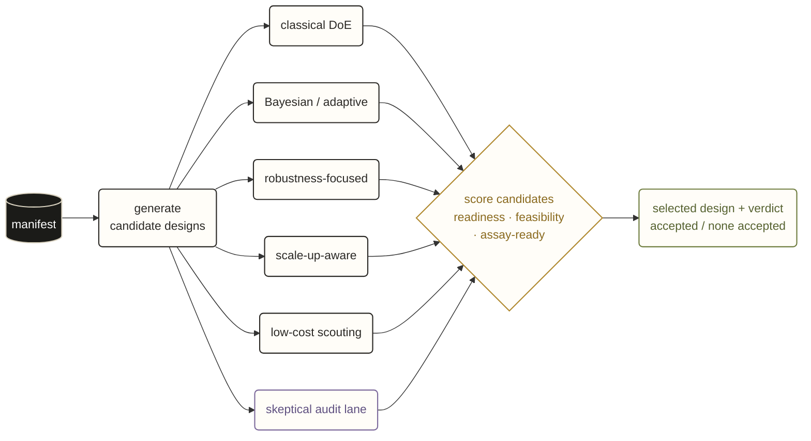
```mermaid
flowchart LR
  M[("manifest")]:::hero --> GEN("generate<br/>candidate designs"):::proc
  GEN --> L1("classical DoE"):::proc
  GEN --> L2("Bayesian / adaptive"):::proc
  GEN --> L3("robustness-focused"):::proc
  GEN --> L4("scale-up-aware"):::proc
  GEN --> L5("low-cost scouting"):::proc
  GEN --> AUD("skeptical audit lane"):::audit
  L1 --> SC{"score candidates<br/>readiness · feasibility<br/>· assay-ready"}:::gate
  L2 --> SC
  L3 --> SC
  L4 --> SC
  L5 --> SC
  AUD --> SC
  SC --> W("selected design + verdict<br/>accepted / none accepted"):::go
  classDef hero fill:#1b1b18,stroke:#d9d2c0,color:#ffffff,stroke-width:1.5px;
  classDef proc fill:#fffdf8,stroke:#2b2926,color:#2b2926,stroke-width:1.5px;
  classDef gate fill:#fffdf8,stroke:#b0892f,color:#8a6a1f,stroke-width:1.5px;
  classDef go fill:#fffdf8,stroke:#6f7d3f,color:#566230,stroke-width:1.5px;
  classDef audit fill:#fffdf8,stroke:#7d6a9c,color:#5f5080,stroke-width:1.5px;
```

The skeptical audit lane informs scoring but is never selected as the design candidate (`tournament.py · run_design_tournament()`).

Cost reports separate simulator estimates, raw materials, operating costs, external manufacturing benchmarks, and the stated uncertainty range:

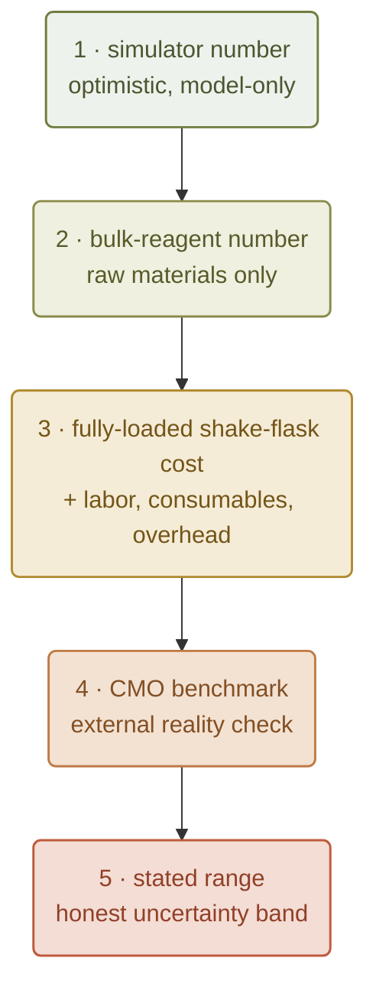
```mermaid
flowchart TB
  C1("1 · simulator number<br/>optimistic, model-only"):::c1
  C2("2 · bulk-reagent number<br/>raw materials only"):::c2
  C3("3 · fully-loaded shake-flask cost<br/>+ labor, consumables, overhead"):::c3
  C4("4 · CMO benchmark<br/>external reality check"):::c4
  C5("5 · stated range<br/>honest uncertainty band"):::c5
  C1 --> C2 --> C3 --> C4 --> C5
  classDef c1 fill:#eef2ec,stroke:#6f7d3f,color:#4c5630,stroke-width:1.5px;
  classDef c2 fill:#f0f0e0,stroke:#8a8b4a,color:#585a2a,stroke-width:1.5px;
  classDef c3 fill:#f5ecd7,stroke:#b0892f,color:#735518,stroke-width:1.5px;
  classDef c4 fill:#f3e2d2,stroke:#bf7a45,color:#834f24,stroke-width:1.5px;
  classDef c5 fill:#f3ddd4,stroke:#bf5a3c,color:#923f28,stroke-width:1.5px;
```

## Demos

Public demos cover the main campaign shapes. The non-BoFire demos run on the stdlib path with zero scientific extras. The BoFire and ENTMOOT demos require their respective optional extras (`pip install biosymphony-ferm-doe[bofire]` or `[entmoot]`); the smoke scripts also run end-to-end without the extras and produce a "not_available" report so the integration shape is testable on any laptop.

| Profile | Demo | What it shows |
|---|---|---|
| `screening` | [`demo-xylanase-public/`](examples/demo-xylanase-public/) | Public xylanase enzyme-production planning; assay-readiness gating; minimum manifest shape |
| `scale_down_qualification` | [`demo-scale-bridge-public/`](examples/demo-scale-bridge-public/) | Planning fixture for a pilot 50 L to bench 2 L downscale with a declared kLa bridge; multi-arm; full `scale_context` |
| `split_plot_fed_batch` | [`demo-split-plot-fedbatch-public/`](examples/demo-split-plot-fedbatch-public/) | Hard-to-change vs easy-to-change factors; whole-plot ID in design rows |
| `screening` | [`demo-pb-screening-public/`](examples/demo-pb-screening-public/) | 7-factor Plackett-Burman plus 4 center-point replicates; closed-loop walkthrough exercising first-batch design, analysis, `plan-wave2`, and finalize end-to-end with synthetic results bundled |
| `screening` (diagnostic) | [`demo-warnings-walkthrough-public/`](examples/demo-warnings-walkthrough-public/) | Intentionally underspecified manifest that surfaces 8 validator warnings; a worked example of the guidance path |
| BoFire route (light) | [`demo-media-cost-bofire/`](examples/demo-media-cost-bofire/) | Media-cost screening that exercises the BoFire `DoEStrategy` route with linear cost and total-mass constraints |
| BoFire route (scale-bridge) | [`demo-shakeflask-to-2l-bofire/`](examples/demo-shakeflask-to-2l-bofire/) | Shake-flask to 2 L scale-bridge with historical ledger ingest and `MultiFidelityVarianceBasedStrategy` routing notes |
| Multi-arm scale transfer | [`engine-multi-arm-scale-transfer-public/`](examples/engine-multi-arm-scale-transfer-public/) | Coupled plate and reactor planning fixture with per-arm bridge policy |
| Reference DOE | [`reference-doe-custom-design/`](examples/reference-doe-custom-design/) | Custom constrained design fixture for reference-DOE parity checks |
| Public paper starter | [`xylanase-wxz1-2012/`](examples/xylanase-wxz1-2012/) | Public-literature-derived starter dataset normalized into the manifest contract |
| Product-class starter | [`yeast-isoprenoid-2l-fedbatch/`](examples/yeast-isoprenoid-2l-fedbatch/) | Hydrophobic product planning fixture with derived productivity and cost responses |
| ENTMOOT smoke | [`entmoot-nchoosek-smoke/`](examples/entmoot-nchoosek-smoke/) | NChooseK Bayesian optimization via ENTMOOT v2, the conservative route for the behavior recorded in the repository's BoFire 0.3.1 audit |

## Design Maps

Use these maps to review experiment inputs, scale-transfer criteria, and the choice of DoE family. [Visual overview](docs/VISUAL_OVERVIEW.md) explains each map.

### Experiment Design Map

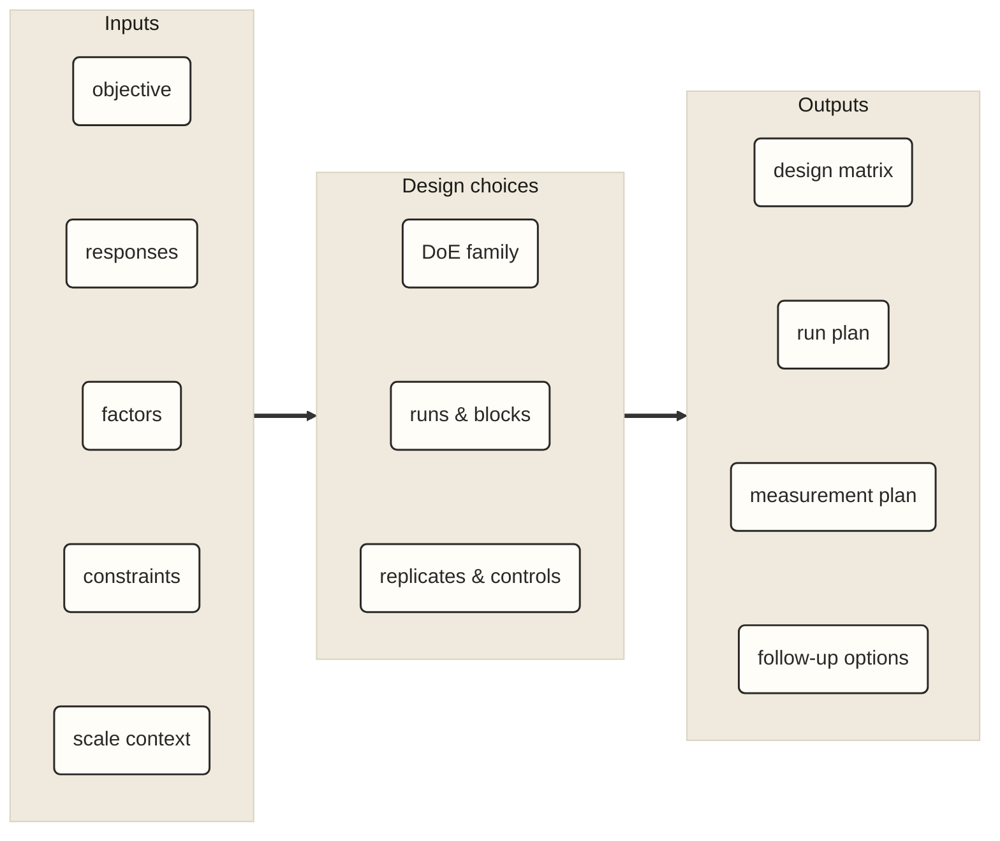
```mermaid
flowchart LR
  subgraph IN["Inputs"]
    direction TB
    O("objective") ~~~ R("responses") ~~~ F("factors") ~~~ C("constraints") ~~~ S("scale context")
  end
  subgraph CH["Design choices"]
    direction TB
    FAM("DoE family") ~~~ RB("runs & blocks") ~~~ RC("replicates & controls")
  end
  subgraph OUT["Outputs"]
    direction TB
    DM("design matrix") ~~~ RP("run plan") ~~~ MP("measurement plan") ~~~ NW("follow-up options")
  end
  IN ==> CH ==> OUT
  classDef proc fill:#fffdf8,stroke:#2b2926,color:#2b2926,stroke-width:1.5px;
  class O,R,F,C,S,FAM,RB,RC,DM,RP,MP,NW proc;
  style IN fill:#efeadd,stroke:#d9d2c0,color:#1b1b18;
  style CH fill:#efeadd,stroke:#d9d2c0,color:#1b1b18;
  style OUT fill:#efeadd,stroke:#d9d2c0,color:#1b1b18;
```

### Scale Transfer Criteria

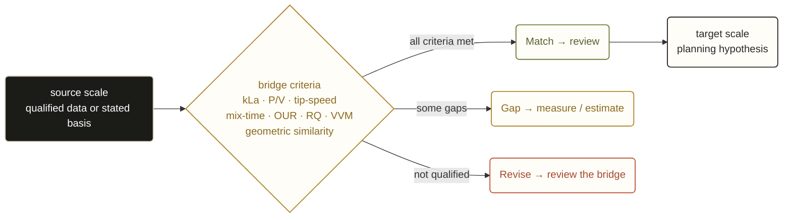
```mermaid
flowchart LR
  SRC("source scale<br/>qualified data or stated basis"):::hero --> BR{"bridge criteria<br/>kLa · P/V · tip-speed<br/>mix-time · OUR · RQ · VVM<br/>geometric similarity"}:::gate
  BR -->|"all criteria met"| MATCH("Match → review"):::go --> TGT("target scale<br/>planning hypothesis"):::proc
  BR -->|"some gaps"| GAP("Gap → measure / estimate"):::gate
  BR -->|"not qualified"| RED("Revise → review the bridge"):::block
  classDef hero fill:#1b1b18,stroke:#d9d2c0,color:#ffffff,stroke-width:1.5px;
  classDef proc fill:#fffdf8,stroke:#2b2926,color:#2b2926,stroke-width:1.5px;
  classDef gate fill:#fffdf8,stroke:#b0892f,color:#8a6a1f,stroke-width:1.5px;
  classDef go fill:#fffdf8,stroke:#6f7d3f,color:#566230,stroke-width:1.5px;
  classDef block fill:#fffdf8,stroke:#bf5a3c,color:#a44a2f,stroke-width:1.5px;
```

### DoE Family Selector

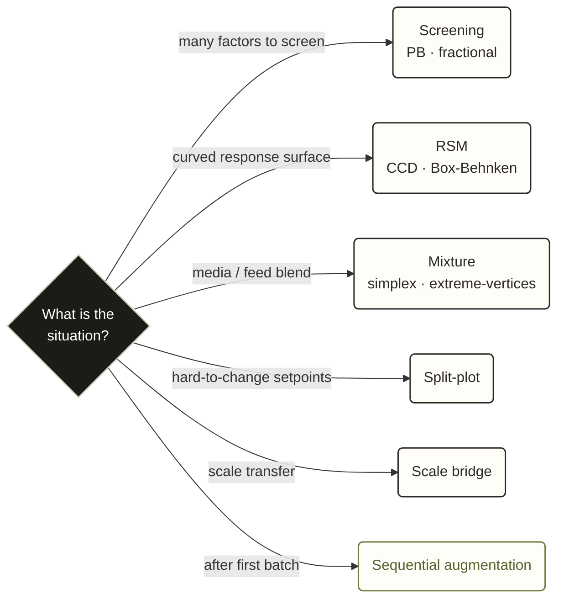
```mermaid
flowchart LR
  Q{"What is the<br/>situation?"}:::hero
  Q -->|"many factors to screen"| SC("Screening<br/>PB · fractional"):::proc
  Q -->|"curved response surface"| RSM("RSM<br/>CCD · Box-Behnken"):::proc
  Q -->|"media / feed blend"| MX("Mixture<br/>simplex · extreme-vertices"):::proc
  Q -->|"hard-to-change setpoints"| SP("Split-plot"):::proc
  Q -->|"scale transfer"| SB("Scale bridge"):::proc
  Q -->|"after first batch"| SA("Sequential augmentation"):::go
  classDef hero fill:#1b1b18,stroke:#d9d2c0,color:#ffffff,stroke-width:1.5px;
  classDef proc fill:#fffdf8,stroke:#2b2926,color:#2b2926,stroke-width:1.5px;
  classDef go fill:#fffdf8,stroke:#6f7d3f,color:#566230,stroke-width:1.5px;
```

## Architecture

The implementation connects campaign inputs, validation, design selection, and generated artifacts:

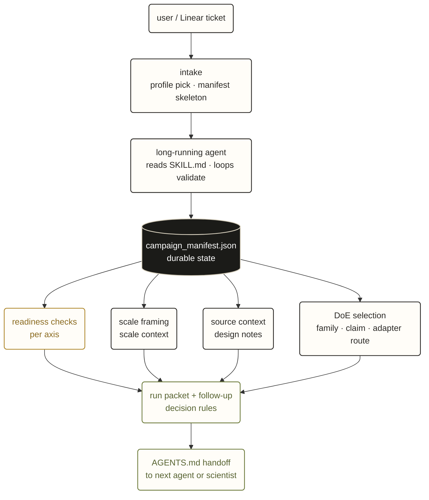
```mermaid
flowchart TB
  U("user / Linear ticket"):::proc --> IN("intake<br/>profile pick · manifest skeleton"):::proc
  IN --> AG("long-running agent<br/>reads SKILL.md · loops validate"):::proc
  AG --> M[("campaign_manifest.json<br/>durable state")]:::hero
  M --> RC("readiness checks<br/>per axis"):::gate
  M --> SF("scale framing<br/>scale context"):::proc
  M --> SRC("source context<br/>design notes"):::proc
  M --> DS("DoE selection<br/>family · claim · adapter route"):::proc
  RC --> RP("run packet + follow-up<br/>decision rules"):::go
  SF --> RP
  SRC --> RP
  DS --> RP
  RP --> HO("AGENTS.md handoff<br/>to next agent or scientist"):::go
  classDef hero fill:#1b1b18,stroke:#d9d2c0,color:#ffffff,stroke-width:1.5px;
  classDef proc fill:#fffdf8,stroke:#2b2926,color:#2b2926,stroke-width:1.5px;
  classDef gate fill:#fffdf8,stroke:#b0892f,color:#8a6a1f,stroke-width:1.5px;
  classDef go fill:#fffdf8,stroke:#6f7d3f,color:#566230,stroke-width:1.5px;
```

## Documentation

- [`docs/README.md`](docs/README.md): grouped documentation map
- [`docs/GLOSSARY.md`](docs/GLOSSARY.md): short definitions of the terms a newcomer hits in the first ten minutes
- [`docs/CLI_REFERENCE.md`](docs/CLI_REFERENCE.md): single-page index of every `ferm-doe` subcommand
- [`docs/ADAPTER_MAP.md`](docs/ADAPTER_MAP.md): capability-centric map of optional extras and their CLI surfaces
- [`examples/README.md`](examples/README.md): demo chooser and expected validation statuses
- [`docs/AGENT_QUICKSTART.md`](docs/AGENT_QUICKSTART.md): copy-paste prompt and first commands for coding agents
- [`docs/USE_CASES.md`](docs/USE_CASES.md): newcomer workflow chooser and example agent requests
- [`docs/WORKFLOWS.md`](docs/WORKFLOWS.md): local, agent, Linear, issue-pack, and cloud-resource workflow map
- [`docs/ORCHESTRATOR_BOUNDARY.md`](docs/ORCHESTRATOR_BOUNDARY.md): what BioSymphony owns versus what an agent, tracker, or cloud runner owns
- [`docs/superpowers.md`](docs/superpowers.md): capability index and high-value planning moves
- [`docs/PUBLIC_ADOPTION_PATH.md`](docs/PUBLIC_ADOPTION_PATH.md): path from first clone to agent harness to handoff
- [`docs/PUBLIC_SECURITY_MODEL.md`](docs/PUBLIC_SECURITY_MODEL.md): local-first privacy, secret, scanner, and deployment boundaries
- [`docs/RELEASE_READINESS_CHECKLIST.md`](docs/RELEASE_READINESS_CHECKLIST.md): local public-switch checklist
- [`docs/ISSUE_PACK_COOKBOOK.md`](docs/ISSUE_PACK_COOKBOOK.md): local issue-pack commands for agent work graphs
- [`docs/ISSUE_PACK_GENERATION.md`](docs/ISSUE_PACK_GENERATION.md): end-to-end runbook for `engine generate-issue-pack` and orchestrator integration
- [`docs/diagrams/agent-loop-public.mmd`](docs/diagrams/agent-loop-public.mmd): maintainable source for the public agent-loop diagram
- [`skills/biosymphony-ferm-doe/SKILL.md`](skills/biosymphony-ferm-doe/SKILL.md): long-agent loop, refuse-vs-warn rules
- [`docs/PROFILES.md`](docs/PROFILES.md): profile registry and composition
- [`docs/SCALE_BRIDGE.md`](docs/SCALE_BRIDGE.md): scale-bridge framework (criteria, bridge_factors, recapitulation)
- [`docs/SCALE_BRIDGE_METHODOLOGY.md`](docs/SCALE_BRIDGE_METHODOLOGY.md): entry conditions, sulfite kLa calibration, scale-down qualification protocol
- [`docs/DOE_FAMILIES.md`](docs/DOE_FAMILIES.md): supported design families
- [`docs/DOE_FAMILY_RECIPES.md`](docs/DOE_FAMILY_RECIPES.md): manifest-patch recipes for swapping `doe.family`
- [`docs/ADAPTIVE_WAVE2.md`](docs/ADAPTIVE_WAVE2.md): first-batch result ingestion, assay-power checks, and follow-up planning artifacts
- [`docs/WAVE2_BOTORCH.md`](docs/WAVE2_BOTORCH.md): follow-up planning walkthrough with the BoTorch backend (qEI / qUCB)
- [`docs/SELF_LEARNING_DOE.md`](docs/SELF_LEARNING_DOE.md): learning ledger, hiccup review, and arm-scoped negative memory runbook
- [`docs/TOOL_REGISTRY.md`](docs/TOOL_REGISTRY.md): curated BO/DoE and sidecar landscape with positioning and adapter status
- [`docs/BIOMANUFACTURING_ADAPTIVE_BACKENDS.md`](docs/BIOMANUFACTURING_ADAPTIVE_BACKENDS.md): backend-selection surface for BoFire, BayBE, Ax/BoTorch, ENTMOOT, OMLT, and TabPFN
- [`docs/BOFIRE_POSITIONING.md`](docs/BOFIRE_POSITIONING.md): when to route to BoFire and when to stay on stdlib
- [`docs/BOFIRE_CONSTRAINT_PATTERNS.md`](docs/BOFIRE_CONSTRAINT_PATTERNS.md): linear, NChooseK, cardinality patterns, including the `SoboStrategy` + `NChooseK` trap
- [`docs/ENTMOOT_SWAP_DESIGN.md`](docs/ENTMOOT_SWAP_DESIGN.md): ENTMOOT v2 NChooseK adapter design and swap criteria
- [`docs/CONTRACTS.md`](docs/CONTRACTS.md): public task request and design-packet contract checks
- [`docs/SWARMS_AND_EVIDENCE.md`](docs/SWARMS_AND_EVIDENCE.md): source-tracking pattern for design rationale
- [`docs/dossier-generation.md`](docs/dossier-generation.md): how the planning packet is assembled and checked
- [`docs/COST_MODEL_REALISM_CHECK.md`](docs/COST_MODEL_REALISM_CHECK.md): cost assumptions, operating costs, and uncertainty ranges
- [`docs/OPEN_DATA_PUBLICATION_STRATEGY.md`](docs/OPEN_DATA_PUBLICATION_STRATEGY.md): how a campaign artifact set maps to a publishable open-data drop
- [`docs/SIMULATOR_V2_SPEC.md`](docs/SIMULATOR_V2_SPEC.md): simulator v2 spec (SPEC ONLY; not yet implemented)
- [`docs/AGENT_HARNESSES.md`](docs/AGENT_HARNESSES.md): Claude Code, OpenAI Agents SDK, Codex CLI, Linear-aware runners, generic harnesses
- [`schemas/campaign_manifest.schema.json`](schemas/campaign_manifest.schema.json): JSON Schema for the manifest
- [`schemas/task_request.schema.json`](schemas/task_request.schema.json): JSON Schema for bounded agent task requests
- [`schemas/engine_task_request.schema.json`](schemas/engine_task_request.schema.json): JSON Schema for the richer engine task router
- [`schemas/tables/`](schemas/tables/): Frictionless-compatible table contracts (run ledger, evidence, equipment, reagent, design, results)
- [`NON_CLAIMS.md`](NON_CLAIMS.md): scope and boundary statements
- [`CHANGELOG.md`](CHANGELOG.md): release history
- [`CONTRIBUTING.md`](CONTRIBUTING.md): how to add profiles, families, demos
- [`agents/`](agents/): runtime-specific agent configs (Claude, OpenAI, generic, Linear)

## Agent Harness Integration

The skill is runtime-agnostic. State lives in `<campaign_dir>/campaign_manifest.json`. Agents update it across turns. The CLI is stdlib-only at runtime; optional scientific dependencies route through adapters that degrade cleanly to a "not_available" report when missing.

- **Repo-local skill**: point a coding agent at [`skills/biosymphony-ferm-doe/SKILL.md`](skills/biosymphony-ferm-doe/SKILL.md). Keep it repo-local or workflow-scoped rather than installed as a global always-on behavior. This is the primary path.
- **Hand-driven CLI**: run `ferm-doe ...` directly from a clone. Useful for a single one-shot check, a scripted pipeline step, or a scientist who wants to drive the planning loop manually.
- **Harness configs**: use [`agents/`](agents/) when an orchestrator owns task routing, state, and review.
- **Claude Code plus Linear**: see [`agents/claude.md`](agents/claude.md) and [`agents/linear.md`](agents/linear.md). Pattern: Linear issue maps to `campaign_id`; tracker-safe readiness fields land as a Linear comment; `stop_rule` firing escalates the issue.
- **OpenAI Agents SDK / Codex CLI plus Linear**: see [`agents/openai.yaml`](agents/openai.yaml) and [`agents/linear.md`](agents/linear.md). Same pattern, different runtime.
- **Generic long-horizon orchestrators**: see [`agents/generic.md`](agents/generic.md). The skill works wherever the agent can read and write the manifest file and shell out to `python3 -m biosymphony_ferm_doe.cli`.

For multi-agent campaigns, the issue-pack contract lets an orchestrator distribute bounded work to parallel sub-agents and converge the results into one review packet, with the manifest as durable state:

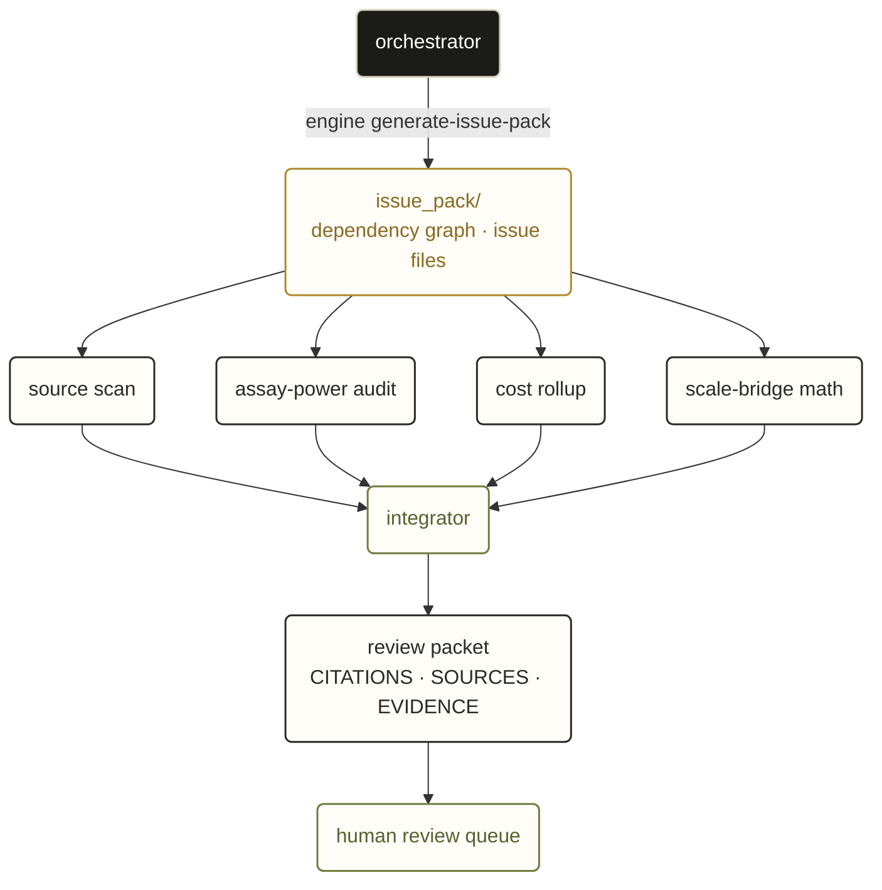
```mermaid
flowchart TB
  O("orchestrator"):::hero
  O -->|"engine generate-issue-pack"| P("issue_pack/<br/>dependency graph · issue files"):::gate
  P --> A1("source scan"):::proc
  P --> A2("assay-power audit"):::proc
  P --> A3("cost rollup"):::proc
  P --> A4("scale-bridge math"):::proc
  A1 --> I("integrator"):::go
  A2 --> I
  A3 --> I
  A4 --> I
  I --> D("review packet<br/>CITATIONS · SOURCES · EVIDENCE"):::proc
  D --> HQ("human review queue"):::go
  classDef hero fill:#1b1b18,stroke:#d9d2c0,color:#ffffff,stroke-width:1.5px;
  classDef proc fill:#fffdf8,stroke:#2b2926,color:#2b2926,stroke-width:1.5px;
  classDef gate fill:#fffdf8,stroke:#b0892f,color:#8a6a1f,stroke-width:1.5px;
  classDef go fill:#fffdf8,stroke:#6f7d3f,color:#566230,stroke-width:1.5px;
```

The full runbook is in [`docs/ISSUE_PACK_GENERATION.md`](docs/ISSUE_PACK_GENERATION.md); pack chooser and copy-paste recipes live in [`docs/ISSUE_PACK_COOKBOOK.md`](docs/ISSUE_PACK_COOKBOOK.md).

## CLI Commands

A single-page index of every `ferm-doe` subcommand, grouped by lifecycle stage, is at [`docs/CLI_REFERENCE.md`](docs/CLI_REFERENCE.md). The snippets below cover common tasks.

```bash
# short summary instead of the full check list
ferm-doe validate examples/demo-scale-bridge-public --summary

# write JSON to a file instead of stdout (good for agent pipes)
ferm-doe validate examples/demo-scale-bridge-public --out /tmp/result.json

# validate a bounded agent task request
ferm-doe validate-task-request templates/task_request.template.json

# route a richer engine task request
ferm-doe engine route-task-request templates/engine_task_request.template.json

# check the compact public design-packet contract surface
ferm-doe check-dossier examples/demo-xylanase-public

# evaluate response-level assay-power assumptions
ferm-doe assay-power examples/demo-xylanase-public

# recommend a DoE family from the manifest
ferm-doe recommend-family examples/demo-xylanase-public

# generate the first-batch design from the manifest's `doe.family`
ferm-doe generate-design examples/demo-xylanase-public \
  --out /tmp/wave1_design.csv \
  --metadata-out /tmp/wave1_design.metadata.json \
  --seed 0

# derive an engineering recipe at to_scale (RPM, sparge, agitator power, kLa)
ferm-doe scale-recipe examples/demo-scale-bridge-public \
  --out /tmp/scale_recipe.json \
  --md-out /tmp/scale_recipe.md

# formulate Derringer-Suich desirability goals from responses and decision_rules
ferm-doe goals examples/demo-xylanase-public --out /tmp/goals.json

# design-level power analysis (per-coefficient MDE)
ferm-doe doe-power examples/demo-xylanase-public --sigma 0.5

# sampling schedule for fed-batch / perfusion runs
ferm-doe sampling-plan examples/demo-scale-bridge-public \
  --out /tmp/sampling.csv \
  --md-out /tmp/sampling.md

# cost / resource rollup against operator-declared unit costs
ferm-doe cost-rollup examples/demo-xylanase-public --out /tmp/cost.json

# fit OLS to first-batch results: effect estimates, permutation p-values, lack-of-fit
ferm-doe analyze examples/demo-pb-screening-public \
  --results examples/demo-pb-screening-public/inputs/wave1_results.csv \
  --out /tmp/analysis.json \
  --md-out /tmp/analysis.md \
  --seed 0

# compose every available artifact into one review-ready planning packet in Markdown
ferm-doe finalize examples/demo-pb-screening-public \
  --out /tmp/run_packet.md \
  --json-out /tmp/run_packet.json \
  --results examples/demo-pb-screening-public/inputs/wave1_results.csv

# plan the follow-up batch from first-batch result rows (stdlib closed-loop)
ferm-doe plan-wave2 examples/demo-pb-screening-public \
  --results examples/demo-pb-screening-public/inputs/wave1_results.csv \
  --out-dir wave2_public_plan \
  --remaining-budget 3

# plan the follow-up batch with BoTorch (Gaussian-process surrogate + acquisition)
# Full walkthrough: docs/WAVE2_BOTORCH.md
ferm-doe plan-wave2 examples/demo-pb-screening-public \
  --results examples/demo-pb-screening-public/inputs/wave1_results.csv \
  --out-dir wave2_bo_plan \
  --backend botorch \
  --acquisition qei \
  --bo-n-candidates 6

# full local engine commands live behind the engine subcommand
ferm-doe engine compile-state \
  --manifest examples/reference-doe-custom-design/campaign_manifest.json \
  --out /tmp/ferm-doe-state
ferm-doe engine compile-dossier \
  --manifest examples/yeast-isoprenoid-2l-fedbatch/campaign_manifest.json \
  --out /tmp/ferm-doe-dossier \
  --run-budget 16
ferm-doe engine utility check-deps

# audit-skip marker on a line names the specific release rule to ignore
# api_key=PLACEHOLDER_NEVER_COMMIT  # audit-skip: assigned_secret_like_value documentation example
```

## Optional Extras

Install only what your campaign needs. Each extra is independently routable; the skill falls back to a stdlib path when the extra is absent. For a capability-centric view ("I want to do X, which extra activates it"), see [`docs/ADAPTER_MAP.md`](docs/ADAPTER_MAP.md). For backend findings, routing limits, and adapter design decisions, see [`docs/BACKEND_EVAL_FINDINGS.md`](docs/BACKEND_EVAL_FINDINGS.md) and [`docs/ADAPTER_DESIGN_NOTES.md`](docs/ADAPTER_DESIGN_NOTES.md).

Which engine for which problem:

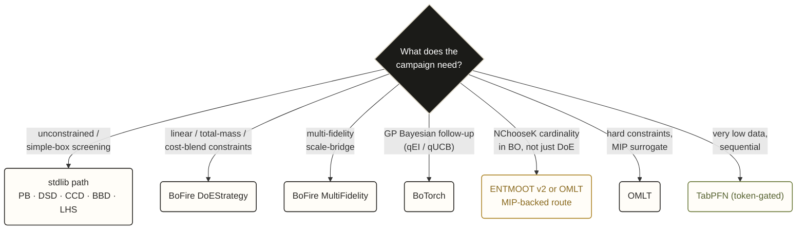
```mermaid
flowchart TB
  Q{"What does the<br/>campaign need?"}:::hero
  Q -->|"unconstrained /<br/>simple-box screening"| STD("stdlib path<br/>PB · DSD · CCD · BBD · LHS"):::proc
  Q -->|"linear / total-mass /<br/>cost-blend constraints"| BF("BoFire DoEStrategy"):::proc
  Q -->|"multi-fidelity<br/>scale-bridge"| BF2("BoFire MultiFidelity"):::proc
  Q -->|"GP Bayesian follow-up<br/>(qEI / qUCB)"| BT("BoTorch"):::proc
  Q -->|"NChooseK cardinality<br/>in BO, not just DoE"| EM("ENTMOOT v2 or OMLT<br/>MIP-backed route"):::gate
  Q -->|"hard constraints,<br/>MIP surrogate"| OM("OMLT"):::proc
  Q -->|"very low data,<br/>sequential"| TP("TabPFN (token-gated)"):::go
  classDef hero fill:#1b1b18,stroke:#d9d2c0,color:#ffffff,stroke-width:1.5px;
  classDef proc fill:#fffdf8,stroke:#2b2926,color:#2b2926,stroke-width:1.5px;
  classDef gate fill:#fffdf8,stroke:#b0892f,color:#8a6a1f,stroke-width:1.5px;
  classDef go fill:#fffdf8,stroke:#6f7d3f,color:#566230,stroke-width:1.5px;
```

| Extra | Install | Adds |
|---|---|---|
| `scipy` | `pip install biosymphony-ferm-doe[scipy]` | Student-t p-values in `analyze`; t-quantile in `doe-power` |
| `pydoe3` | `pip install biosymphony-ferm-doe[pydoe3]` | Box-Behnken for k >= 5 and maximin Latin Hypercube |
| `botorch` | `pip install biosymphony-ferm-doe[botorch]` | Gaussian-process Bayesian optimization for follow-up planning in `plan-wave2` |
| `bofire` | `pip install biosymphony-ferm-doe[bofire]` | `DoEStrategy`, `SoboStrategy`, `MultiFidelityVarianceBasedStrategy` routing for constrained DoE and BO |
| `entmoot` | `pip install biosymphony-ferm-doe[entmoot]` | NChooseK Bayesian optimization via ENTMOOT v2 (cardinality-aware) |
| `omlt` | `pip install biosymphony-ferm-doe[omlt]` | MIP-based surrogate planning over linear and NChooseK constraints |
| `tabpfn` | `pip install biosymphony-ferm-doe[tabpfn]` | Token-gated foundation-model surrogate route for low-data sequential planning |
| `backend-eval` | `pip install biosymphony-ferm-doe[backend-eval]` | BayBE and Ax imports for backend comparison fixtures |
| `sensitivity` | `pip install biosymphony-ferm-doe[sensitivity]` | SALib sensitivity analysis on result rows |
| `report` | `pip install biosymphony-ferm-doe[report]` | Plotly figures in the BoFire HTML report |
| `contracts` | `pip install biosymphony-ferm-doe[contracts]` | Frictionless validation of table contracts |

## FAQ

**Q. Does this generate DoE designs?**
A. Yes. `ferm-doe generate-design` emits a first-batch design CSV directly from the campaign manifest, stdlib only, no external generator required. Supported families and claim levels: `full_factorial`, `fractional_factorial`, `plackett_burman` (n in {8, 12, 16, 20, 24}), `definitive_screening` (k in {3..6, 9, 10}), `central_composite` (face-centered, rotatable, orthogonal), `box_behnken` (k in {3, 4}), `latin_hypercube`, and `scheffe_mixture` are emitted at `claim_level: exact`. `optimal_d`, `optimal_i`, and `extreme_vertices_mixture` use coordinate exchange or constraint enumeration and are labeled `heuristic`; review with a statistician before expensive runs. Follow-up candidate rows come from `ferm-doe plan-wave2` under `claim_level: planned_wave2_design`. Every row in every output carries the claim level so a statistician can see exactly how rigorously the matrix was produced.

**Q. Does this adapt after the first batch?**
A. Yes, in planning mode. `ferm-doe plan-wave2` joins trusted, QC-passing result rows, evaluates assay-power policy, writes negative memory and learning artifacts, and recommends `confirm`, `narrow`, `expand`, `pause`, `stop`, or a bridge-gated `scale_or_downscale` plan for the next experiment round. With `--backend botorch`, it routes through a Gaussian-process surrogate and an acquisition function (qEI or qUCB) for `n_candidates` follow-up points. Outputs are labeled `planned_wave2_design` or `bayesian_optimization_planned`, not validated optimization. The proposed next batch is derived from supplied data rather than a fixed script:

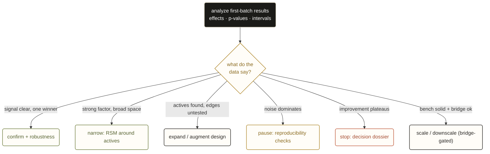
```mermaid
flowchart TB
  A("analyze first-batch results<br/>effects · p-values · intervals"):::hero --> Q{"what do the<br/>data say?"}:::gate
  Q -->|"signal clear, one winner"| C("confirm + robustness"):::go
  Q -->|"strong factor, broad space"| N("narrow: RSM around actives"):::go
  Q -->|"actives found, edges untested"| E("expand / augment design"):::proc
  Q -->|"noise dominates"| P("pause: reproducibility checks"):::gate
  Q -->|"improvement plateaus"| ST("stop: decision dossier"):::block
  Q -->|"bench solid + bridge ok"| SCp("scale / downscale (bridge-gated)"):::proc
  classDef hero fill:#1b1b18,stroke:#d9d2c0,color:#ffffff,stroke-width:1.5px;
  classDef proc fill:#fffdf8,stroke:#2b2926,color:#2b2926,stroke-width:1.5px;
  classDef gate fill:#fffdf8,stroke:#b0892f,color:#8a6a1f,stroke-width:1.5px;
  classDef go fill:#fffdf8,stroke:#6f7d3f,color:#566230,stroke-width:1.5px;
  classDef block fill:#fffdf8,stroke:#bf5a3c,color:#a44a2f,stroke-width:1.5px;
```

**Q. When do I route to BoFire vs the stdlib path?**
A. See [`docs/BOFIRE_POSITIONING.md`](docs/BOFIRE_POSITIONING.md). Short version: stdlib for unconstrained or simple-box screening and adaptive follow-up planning; BoFire for linear or nonlinear constraint blends (cost, total-mass, NChooseK) and for multi-fidelity scale-bridge planning. The BoFire adapter degrades to a "not_available" report when the extra is absent, so smoke scripts run on any laptop.

**Q. When do I route to ENTMOOT instead of BoFire?**
A. When Bayesian follow-up must enforce NChooseK cardinality constraints. The repository's BoFire 0.3.1 audit found that `SoboStrategy` plus `NChooseK` did not return candidates. Upstream issue #450 is now closed, but later BoFire releases have not been evaluated against this adapter. ENTMOOT and OMLT remain the conservative MIP-backed routes. See [`docs/ENTMOOT_SWAP_DESIGN.md`](docs/ENTMOOT_SWAP_DESIGN.md).

**Q. What about BayBE, Ax, OMLT, and TabPFN?**
A. They are optional evaluation routes that keep the campaign manifest as the source of state. See [`docs/BIOMANUFACTURING_ADAPTIVE_BACKENDS.md`](docs/BIOMANUFACTURING_ADAPTIVE_BACKENDS.md). BoFire remains the default constrained static DoE/BO route. BayBE is a low-data and hybrid-space comparison target; Ax/BoTorch is for custom modeling or trial lifecycle pilots; OMLT is a MIP-surrogate route for hard constraints; TabPFN is a token-gated low-data surrogate experiment.

**Q. Why is the verdict YELLOW for the demos?**
A. The demos use synthetic placeholder data with `readiness_expectation: YELLOW`. The verdict reflects that the demos are pre-experiment plans on synthetic inputs; the schema carries that readiness caveat through to anything consuming the manifest. The diagnostic walkthrough demo additionally exercises the validator's guidance path.

**Q. Can I use this for mammalian cell culture, not just microbial fermentation?**
A. Yes. The schema is organism-agnostic. Scale-bridge criteria like P/V and tip speed are common for shear-sensitive mammalian work; kLa is more common for microbial. See [`docs/SCALE_BRIDGE.md`](docs/SCALE_BRIDGE.md).

**Q. How is this different from a Jupyter notebook with pyDOE3?**
A. The toolkit adds a campaign manifest, input and measurement checks, source references, follow-up planning, and handoff files around design generation. You can use a notebook to inspect or extend those outputs.

**Q. Is the skill stateful or stateless?**
A. The skill itself is stateless. State lives in the campaign manifest file. The agent that uses the skill is responsible for persisting and updating that file across turns.

**Q. Does this work without an agent?**
A. Yes. The CLI runs standalone, and a scientist can call `ferm-doe validate`, `generate-design`, `analyze`, `plan-wave2`, and `finalize` directly. The repo is designed around agent harnesses because that is where multi-turn campaign state, parallel sub-agent dispatch, and cross-session handoff actually pay off, but the individual commands are useful on their own.

**Q. What about GxP / regulatory contexts?**
A. GxP batch records require a separately-validated execution pipeline. This tool covers the planning step that feeds one. See [`NON_CLAIMS.md`](NON_CLAIMS.md).

**Q. Can I use private data with this skill?**
A. Yes. Keep private campaigns in a separate non-public workspace and do not commit them here. `claim_level` is a provenance label, not a sanitization control; scanners, release checks, and secret checks still apply before anything is shared.

**Q. What does "long-running agent" mean concretely?**
A. An agent session that spans hours or days, accumulates context, may pause and resume, and may hand off to other agents or humans. Examples: a Claude Code session driving a multi-week design effort; a Codex worker that tracks a Linear project; a custom orchestrator running between waves.

## Status

Pre-alpha (`0.1.0a0`). Validators report advisory gaps as warnings and missing required inputs, structural contradictions, or public-safety violations as errors. Run `validate --summary` after campaign edits; use the full report to investigate failed checks.

## Contributing

See [`CONTRIBUTING.md`](CONTRIBUTING.md). Public-safe synthetic demos are welcome; do not include private process data in this repo.

## License

[MIT](LICENSE).

## Related Work

- [Garcia-Ochoa & Gomez 2009](https://doi.org/10.1016/j.biotechadv.2008.10.006): kLa review (cited in the scale-bridge demo)
- [Junker 2004](https://doi.org/10.1263/jbb.97.347): scale-up review
- [Jones & Nachtsheim 2011](https://www.tandfonline.com/doi/abs/10.1080/00224065.2011.11917841): Definitive Screening Designs
- [Jones & Nachtsheim 2009](https://doi.org/10.1080/00224065.2009.11917782): split-plot guidance
- [Studier 2005](https://doi.org/10.1016/j.pep.2005.01.016): lactose autoinduction

## Topics

`fermentation` `bioprocess` `biomanufacturing` `bioreactor` `cell-culture` `fed-batch` `perfusion` `design-of-experiments` `experimental-design` `doe` `bayesian-optimization` `optimization` `scale-up` `scale-down` `kla` `python` `biosafety` `agentic-ai` `ai-agents` `claude-code`
