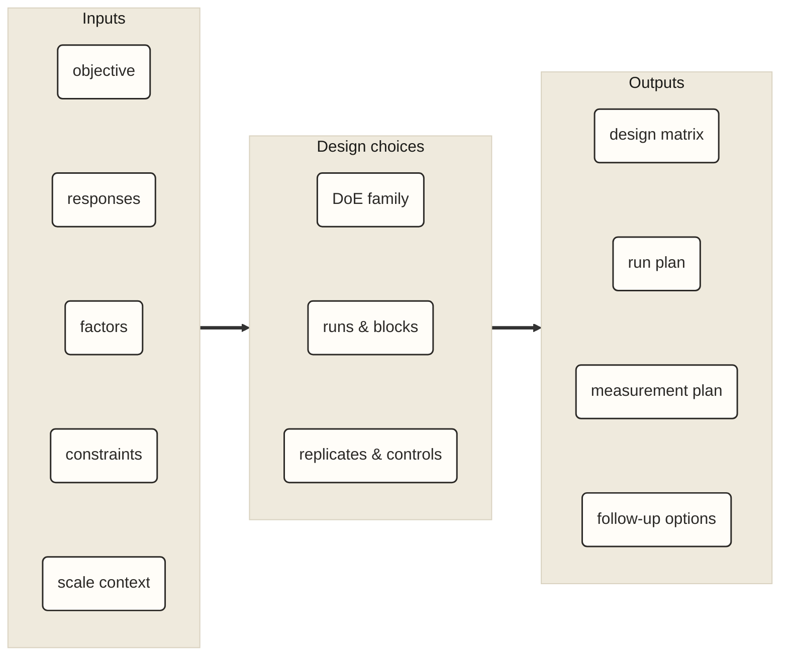
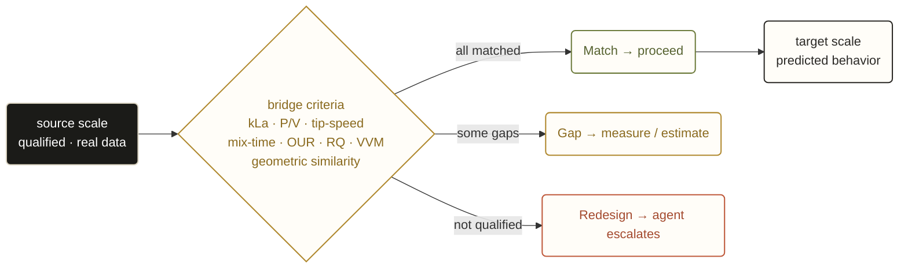
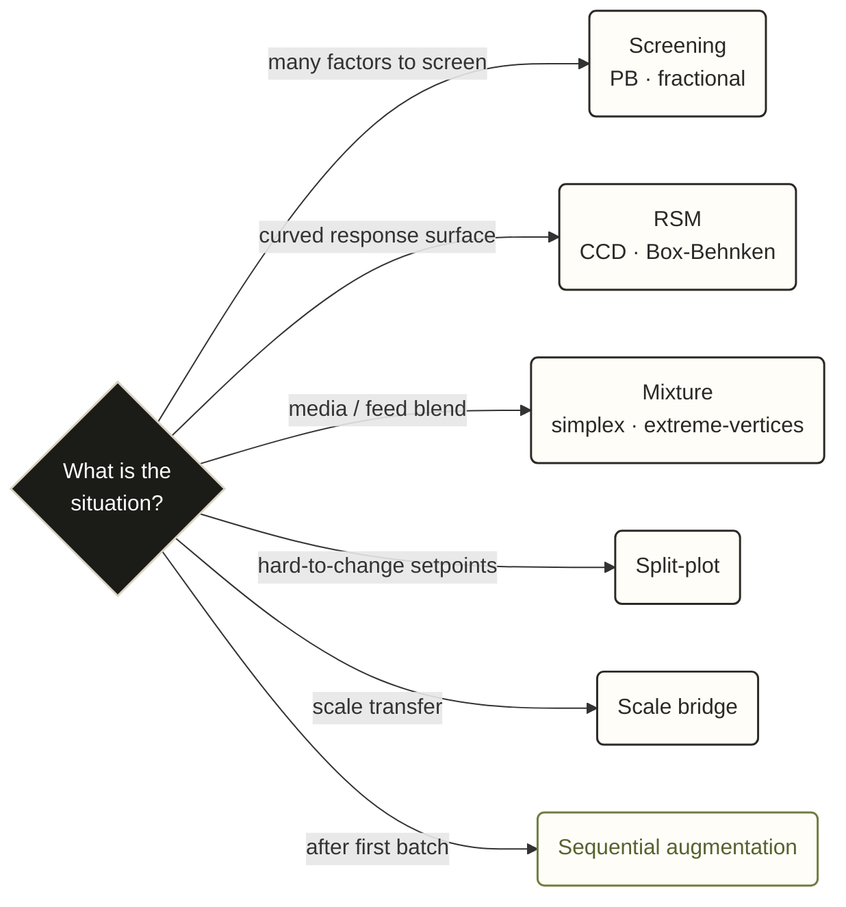

# Visual Overview

These diagrams summarize the main design questions in the repo: what varies, what is constrained, how scale transfer is handled, and which DoE family fits the campaign.

## Experiment Design Map

Start from the experiment inputs: objective, responses, factors, constraints, and scale context. These determine the DoE family, run structure, blocking, replication, controls, and measurement plan.

The useful check is direct: define what varies, what stays fixed, and what will be measured.

## Scale Transfer Criteria

Scale-up and scale-down decisions depend on criteria such as `kLa`, `P/V`, tip speed, mix time, DO/OUR, VVM, and geometry. The design should show what is measured, estimated, or missing before choosing the next run set.

The practical output is a match, gap, or redesign call for the transfer step.

## DoE Family Selection

The DoE family changes run count, blocking, replication, and interpretation. Common routes include:

- screening for many factors
- RSM for curved response surfaces
- mixture designs for media blends
- split-plot designs for hard-to-change setpoints
- scale bridge designs for transfer criteria
- sequential augmentation after first-batch

The same campaign can move between families as data arrives.
