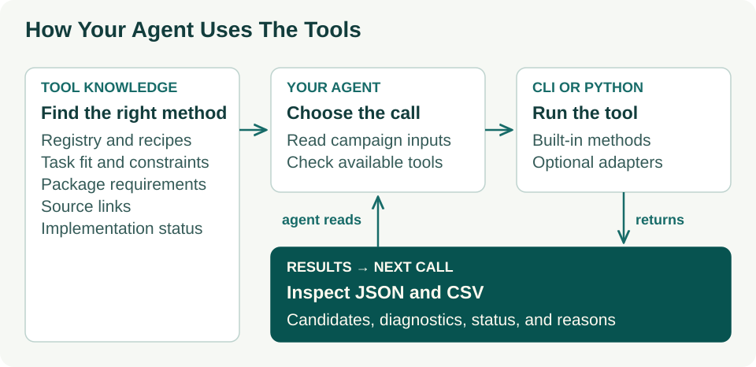
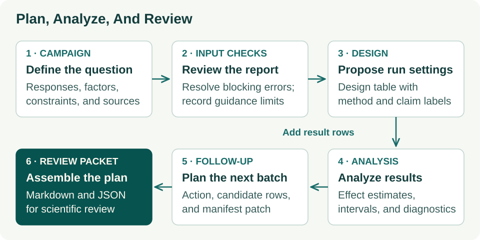
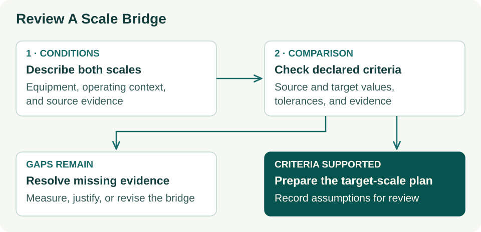

# Visual Overview

## Tool Selection And Calling

The [registry](TOOL_REGISTRY.md) records task fit and implementation status. The [adapter map](ADAPTER_MAP.md) identifies callable entry points. Your agent reads those references and controls the sequence. See the [Mermaid version](diagrams/agent-loop-public.mmd).

## Chaining Calls

Commands share campaign inputs and result tables. The agent inspects each output before choosing the next call. Analysis JSON informs that review; the follow-up planner reads the supplied result rows directly. See the [README walkthrough](../README.md#planning-workflow).

## Scale Review

The campaign declares criteria and tolerances. Record the evidence for each comparison; see the [scale-bridge framework](SCALE_BRIDGE.md).
