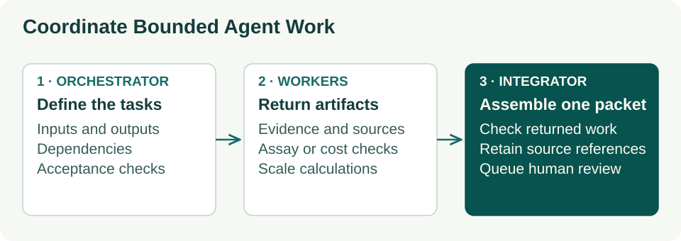

# Visual Overview

The README contains three diagrams for the planning workflow, scale review, and bounded agent work. Each SVG is editable text with a title and description for accessibility.

## Planning Workflow

Analysis requires supplied result rows. The screening demo uses synthetic results. See the [agent quickstart](AGENT_QUICKSTART.md) for commands and expected outputs, or the [Mermaid version](diagrams/agent-loop-public.mmd) for a text-rendered flowchart.

## Scale Review

The campaign declares its criteria and tolerances. Record the evidence for each comparison; see the [scale-bridge framework](SCALE_BRIDGE.md). Scale transfer is a campaign context, while a DoE family defines the design structure. The [design recipes](DOE_FAMILY_RECIPES.md) describe supported choices.

## Bounded Agent Work

The orchestrator owns dispatch and dependencies. The toolkit supplies task contracts and artifact checks. See the [issue-pack runbook](ISSUE_PACK_GENERATION.md).
