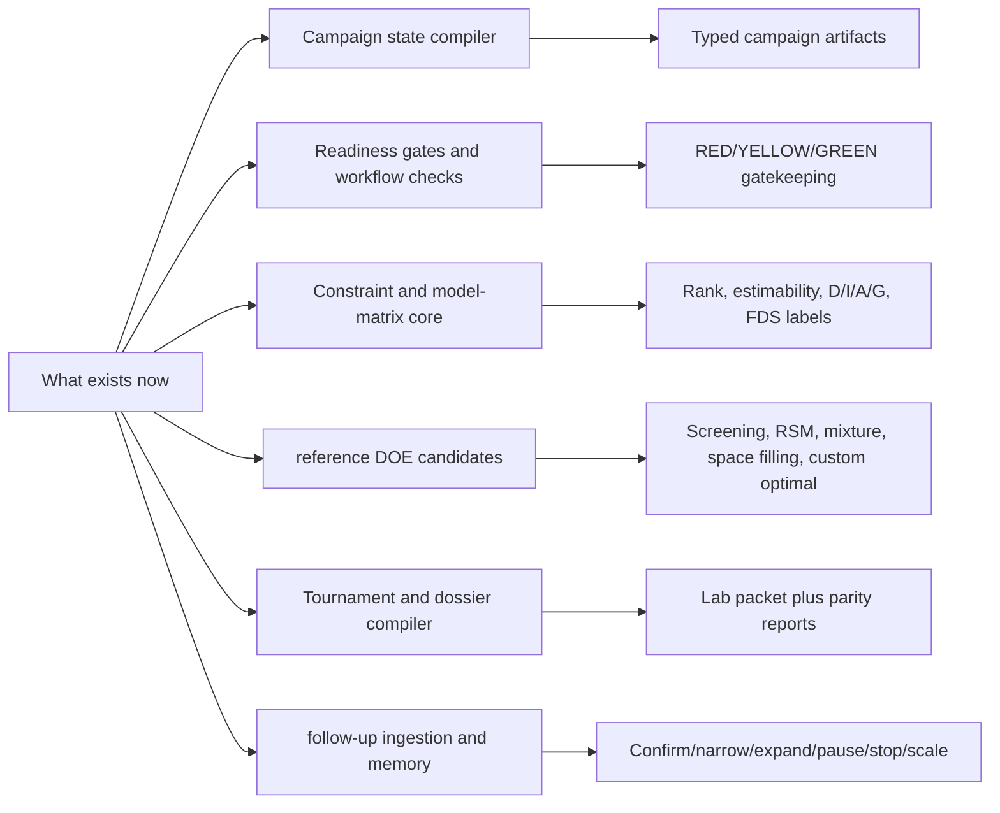
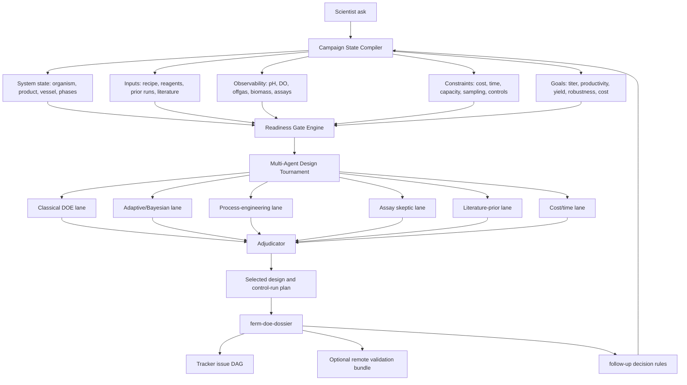

# Superpower Roadmap vs Reference DOE

## Point Of View

Commercial DOE software is already strong at classical and modern DOE once the experiment has been statistically framed. BioSymphony Ferm DoE should not pretend that a generic checklist beats that baseline.

The superpower is earlier and broader:

```text
messy bioprocess ask
  -> campaign state compiler
  -> scientific readiness gates
  -> multi-agent strategy tournament
  -> DOE backend selection and scoring
  -> runnable ferm-doe-dossier
  -> tracker issue DAG
  -> result ingestion and follow-up planner
```

If we only create documents, checklists, and static packs, we are creating noise for a future planner. If we create executable campaign state, validators, design scoring, and memory, we are giving the planner leverage it does not get from a generic agent harness.

## Current State



Current status: local engine baseline. It has executable campaign compilation, deterministic DOE candidates, model-matrix diagnostics, design comparison, readiness vetoes, dossier generation, dry-run issue packs, and follow-up ingestion. It is not claiming complete commercial DOE statistical parity where local implementations are labeled approximate or heuristic.

## Reference DOE Baseline

Commercial DOE documentation sets a real benchmark:

- Custom design support for real constraints, process limitations, and budgets.
- Screening support for full factorial, fractional factorial, Plackett-Burman, mixed-level screening, and definitive screening designs.
- Response-surface, mixture, space-filling, and augmentation workflows.
- Design evaluation with power analysis, prediction variance profiles, fraction-of-design-space plots, alias matrices, correlations, and efficiency diagnostics.
- Optimality criteria including D-, I-, A-, Bayesian, and alias-optimal variants.

Implication: BioSymphony Ferm DoE should not compete by manually rephrasing DOE. It should compete by doing the work commercial DOE tools do not own: problem formation, evidence gathering, assay/process readiness, phase-aware bioprocess planning, agent tournaments, execution packets, and adaptive campaign memory.

## Where BioSymphony Must Be Better

| Layer | Reference DOE Strength | BioSymphony Ferm DoE Superpower |
| --- | --- | --- |
| Factor table | Strong once factors are known | Infer and challenge candidate factors from biology, vessel, product class, phases, observability, prior data, and literature |
| Experimental design | Strong optimal/custom designs | Choose among DOE strategies using campaign context, feasibility, assay risk, and future follow-up value |
| Constraints | Strong mathematical restrictions | Convert lab reality into constraints: sampling load, pH/base demand, feedability, foam, oxygen demand, cost ceiling, run duration |
| Response definition | User supplied | Force response semantics: titer, productivity, yield, product per biomass, quality, whole-broth vs pellet-associated product |
| Scale transfer | Not the main product | Treat flask-to-bioreactor, scale-up, and downscale as first-class workflow modes |
| Literature priors | Outside reference DOE | Dispatch agents to PubMed, bioRxiv, Google Scholar, protocols, and prior runs, then convert evidence into factor priors |
| Execution packet | Table-centric | Produce run sheet, sampling schedule, reagent plan, capture schema, control strategy, and follow-up rules |
| Campaign memory | Manual | Store negative-result memory and feed it into the next compiler pass |

## Target Architecture



## Workflow Modes

Packs should be autonomous workflow modes. They should accelerate the planner without limiting reasoning.

| Mode | What It Handles | Non-Negotiable Guardrails | Superpower Test |
| --- | --- | --- | --- |
| `autonomous-multi-agent-doe-planner` | Any culture or fermentation optimization ask | Must produce competing design strategies, not one default DOE | Does the planner produce a tournament and adjudication rubric? |
| `shake-flask-to-benchtop-bioreactor` | Flask recipe to controlled pH/DO/feed run | Must address pH drift removal, oxygen transfer, inoculum basis, foam, feedability, and response comparability | Does it catch what breaks when moving from uncontrolled flask to controlled reactor? |
| `batch-to-fedbatch-production` | Growth phase, induction/switch, production feed, harvest | Must separate growth and production factor spaces | Does it prevent one flat DOE from mixing phase-specific knobs? |
| `bioreactor-scale-up-planner` | 2 L to larger scale | Must address kLa/OTR, mixing, heat, pH/base demand, sensor/control differences | Does it turn scale transfer into constraints, not vibes? |
| `bioreactor-to-plate-downscale` | Cheaper scouting route | Must address evaporation, edge effects, oxygen, mixing, fill volume, assay throughput, scale relevance | Does it tell us what plate results can and cannot mean? |
| `biomanufacturing-cost-productivity-minimizer` | Titer/productivity/cost/time tradeoff | Must score final titer against productivity, cost per L, run length, and sampling burden | Does it recommend an earlier harvest if economics support it? |
| `assay-product-class-planner` | Product-class response semantics | Must distinguish extracellular, intracellular, pellet-associated, volatile, activity, quality | Does it block a wrong response definition before DOE? |

## Pack Design Rule

A pack is allowed only if it provides at least one of these:

- a schema the planner must fill
- a validator that can fail
- a scoring function or objective transform
- a known failure-mode lint
- an issue graph that saves orchestration time
- a benchmark example with expected outputs

If a pack is only advice that a strong planner can invent in one paragraph, delete it.

## What To Harden Next

1. Optional DOE adapters
   - Add pyDOE3/SciPy/statsmodels/scikit-learn adapters where they improve exactness.
   - Keep stdlib fallback and metric labels.

2. Bayesian and augmentation adapters
   - Add BoFire/BoTorch only behind optional extras.
   - Preserve local augment-design fallback for users without GPU/cloud.
   - **BoFire scope:** treat as a focused powerup (constrained DoE,
     multi-objective BO, multi-fidelity scale-bridge), not a runtime
     replacement. Routing rule and high-ROI scenarios in
     [`BOFIRE_POSITIONING.md`](BOFIRE_POSITIONING.md). Defer adapter
     until BoFire 0.4 ships (multi-fidelity PR #705 and LLM-Strategy
     PR #749 are on main but not yet tagged).

3. More fermentation examples
   - Add sanitized public/synthetic ledgers for plate, flask, fed-batch, downscale, and mixture-media cases.
   - Keep public paper data separate from inferred or synthetic planning data.

4. Optional remote-compute dry-run bundle
   - Only after local tests and dossier checks are boring.
   - No live launch unless explicitly requested.

5. UI or notebook surface
   - Defer until the file/CLI contract remains stable across real campaigns.

## Product Bar

BioSymphony Ferm DoE is only superpowered if it changes the decision quality before a lab run.

For every workflow, ask:

1. Did it prevent a bad experiment?
2. Did it discover a better objective or response definition?
3. Did it make scale transfer explicit?
4. Did it create a design that is more runnable than a generic DOE table?
5. Did it produce artifacts the lab can execute without translation?
6. Did it produce rules for what to do after results arrive?

If the answer is no, it is documentation noise rather than a working superpower.
